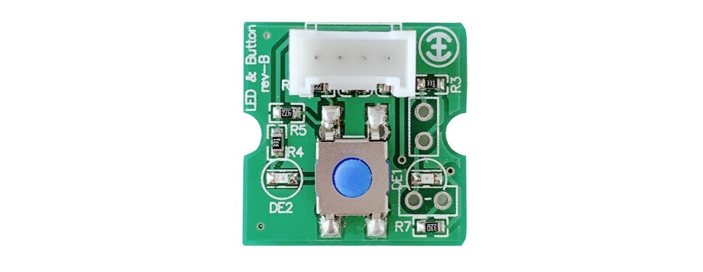
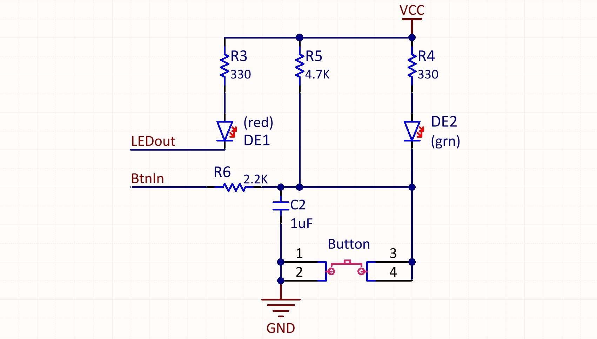
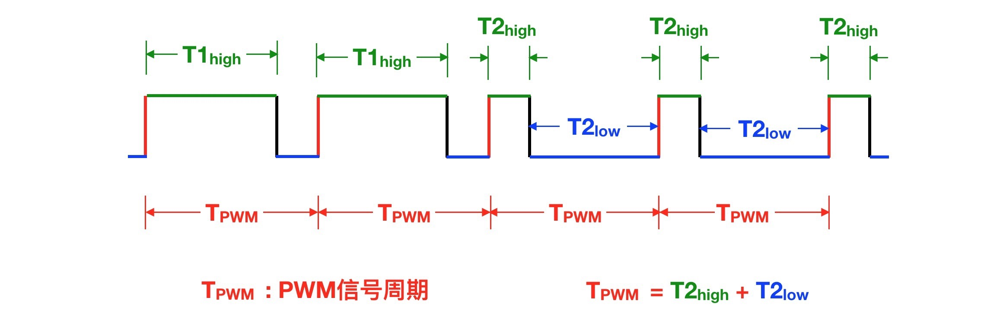
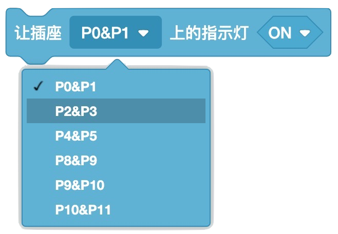
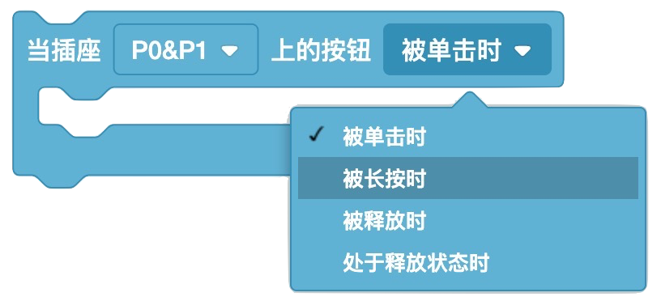
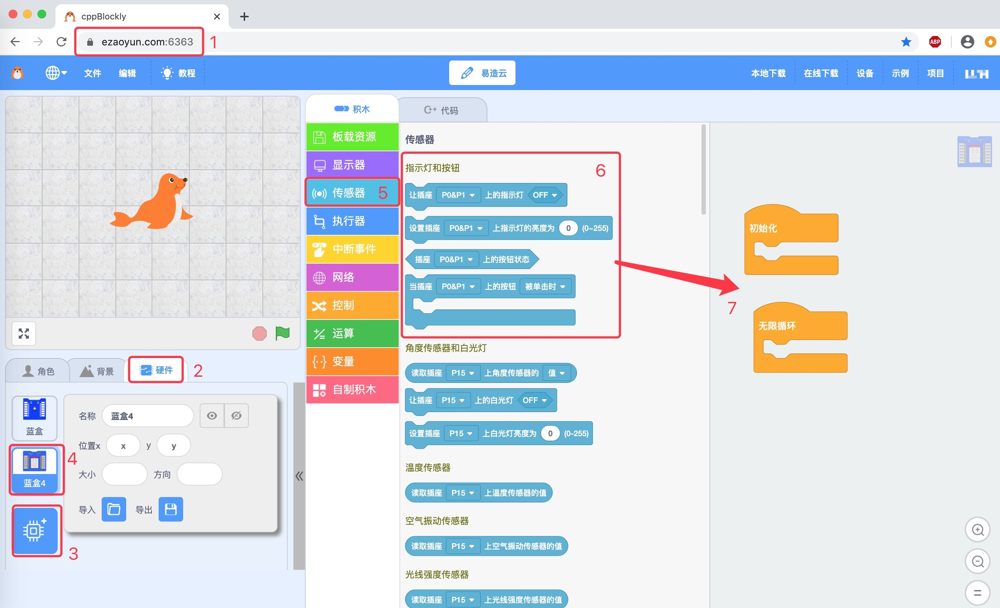
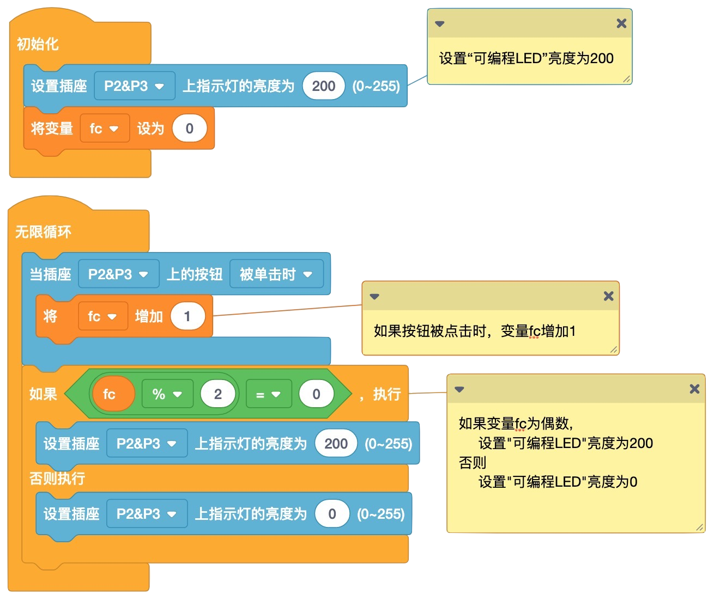

.. _Grove_A2_LED_ButtonModule:

============================
LED指示灯和按钮模块(Grove接口)
============================

LED指示灯和按钮模块是最简单、最常用的一种I/O接口。

该模块上有两个LED指示灯，分别为红色和绿色。其中红色LED指示灯是可编程控制的，不仅可以用程序控制这个红色LED的亮/灭，也可以控制
其亮度(PWM方式)。绿色LED指示灯的亮/灭与按钮的状态完全同步，当按钮被按下时，绿色LED自动亮起，当按钮释放时，绿色LED自动熄灭。
LED指示灯和按钮模块的电路原理图如下图所示。

.. note::
    * 当按钮被按下时，绿色LED亮起；当按钮释放时，绿色LED灭掉。你可以使用欧姆定律分析上面电路图中R4和DE2支路，即可验证这一现象
    * 红色LED亮/灭与LEDout信号电平有什么关系呢？ 根据上面的分析，当LEDout信号为低电平时，红色LED亮；高电平时，红色LED灭
    * 使用PWM信号控制红色LED的亮度。PWM信号是一种固定周期但高电平宽度可变的数字信号，如下图所示。高电平宽度越宽，红色LED亮度越低；反之，越亮

.. note::
    * 按钮按下时，BtnIn信号为低电平
    * 按钮释放时，BtnIn信号为高电平

----------------------

LED指示灯和按钮模块的技术参数
============================

LED指示灯和按钮模块，由红色和绿色2颗LED、轻触按钮组成，采用4线Grove接口。

==========  ====================================
LED颜色      红(可编程的)、绿(与按钮状态同步)
LED规格      2.0x0.8mm
LED总数      2颗(一个可编程，一个与按钮状态同步)
按钮         1个(被按下时为低电平，释放时为高电平)
LED亮度      可调(PWM方式)
电气接口      Grove
接口逻辑      3.3V/5V
供电电压      3～5V
供电电流      100%亮度时最大10mA
外型尺寸      20x20x15mm
重量         5g
==========  ====================================

LED指示灯和按钮模块的用法
=======================

LED指示灯和按钮模块的电气接口采用4线(2mm间距)Grove接口，4个引脚的名称和功能如下：

========  ========  ========
1         Gnd       电源地线
2         Vdd       电源正极
3         BtnIn     按钮状态信号
4         LEDout    红色LED控制信号
========  ========  ========

Scratch编程控制LED指示灯和按钮模块的积木块
=========================================

在Scratch图形化编程环境，共有4种积木块用于对LED指示灯和按钮模块进行编程。

*1. 让LED指示灯和按钮模块上的红色LED亮/灭*

*2. 控制LED指示灯和按钮模块上的红色LED亮度*

*3. 获取LED指示灯和按钮模块上的按钮状态*

*4. 当LED指示灯和按钮模块上的按钮被点击时/被长按时/被释放时/处于释放状态时*

Arduino编程控制LED指示灯和按钮模块的(C/C++)API
=========================================

*1. 控制LED指示灯和按钮模块上的红色LED亮/灭*

    void digitalWrite(P2, LOW); // 让红色LED亮
    void digitalWrite(P2, HIGH); // 让红色LED灭

功能: 控制LED指示灯和按钮模块上的红色LED亮/灭
参数1: 指定与红色LED连接的MCU的I/O引脚编号
参数2: 指定红色LED的控制电平：LOW/亮；HIGH/灭
返回值: none

*2. 控制LED指示灯和按钮模块上的红色LED亮度*

    void pwmWrite(P2, 20); // 红色较亮
    void pwmWrite(P2, 255); // 让红色LED灭

依赖库: *PWM_ESP.h*
功能: 控制LED指示灯和按钮模块上的红色LED亮度
参数1: 指定与红色LED连接的MCU的I/O引脚编号
参数2: 指定红色LED的亮度，有效值：0(最亮) ~ 255(灭)
返回值: none

*3. 获取LED指示灯和按钮模块上的按钮状态*

    boolean digitalRead(P3); // 读取按钮状态

功能: 获取LED指示灯和按钮模块上的按钮状态
参数1: 指定与红色LED连接的MCU的I/O引脚编号
返回值: bool型状态，LOW/被按下状态；HIGH/释放状态

*4. 检查LED指示灯和按钮模块上的按钮是否处于被按下状态*

    boolean btn.isPressed(); // 按钮被点击？

依赖库: *Button.h*
功能: 检查LED指示灯和按钮模块上的按钮是否处于被按下状态
参数1: none
返回值: bool型状态，true/被按下的状态；false/未被按下

*5. 检查LED指示灯和按钮模块上的按钮是否处于释放状态*

    boolean btn.isReleased(); // 按钮被释放？

依赖库: *Button.h*
功能: 检查LED指示灯和按钮模块上的按钮是否处于释放状态
参数1: none
返回值: bool型状态，true/处于释放状态；false/未被释放

*6. 检查LED指示灯和按钮模块上的按钮是否被按下过*

    boolean btn.wasPressed(); // 按钮被按下过？

依赖库: *Button.h*
功能: 检查LED指示灯和按钮模块上的按钮是否被按下过
参数1: none
返回值: bool型状态，true/被按下过；false/未被按下过

*7. 检查LED指示灯和按钮模块上的按钮是否被释放过*

    boolean btn.isReleased(); // 按钮被释放？

依赖库: *Button.h*
功能: 检查LED指示灯和按钮模块上的按钮是否被释放过
参数1: none
返回值: bool型状态，true/被释放过；false/未被释放过

*8. 检查LED指示灯和按钮模块上的按钮是否被按下且超过指定时间*

    boolean btn.pressedFor(uint32_t t); // 按钮被按下且超过指定时间吗？

依赖库: *Button.h*
功能: 检查LED指示灯和按钮模块上的按钮是否被按下且超过指定时间
参数1: 指定被按下的时间，时间单位为ms
返回值: bool型状态，true/被按下且超过指定时间；false/未被按下或被按下但未超过指定时间

在Scratch环境使用LED指示灯和按钮模块
=================================

 **应用示例1:**

我们浏览器中打开 `易造云平台`_ (https://www.ezaoyun.com/)，在主页面的工具栏中选择 `Scratch`_ 将会打开在线版
Scratch编程环境。这个在线版Scratch编程环境不仅完全兼容MIT版的Scratch3，还支持硬件编程。换句话说，你可以使用自己熟
悉的Scratch图形化编程语言进行编程来控制计算机硬件，与计算机硬件交互。譬如，我们可以用Scratch编程控制条状LED显示器。

首先，我们看看Scratch编程环境中的LED指示灯和按钮的积木块位置。在Scratch编程环境的角色选择区，点击“硬件”标签，然后点击“添加硬件”标签，
在打开的硬件选择窗口中选择 `BlueBox4(蓝盒4)`_ 。这一步操作类似于“添加角色”。接着，打开“显示器“积木抽屉，滚动鼠标滑轮，
你将会看到”LED指示灯和按钮“类积木块，其中包含有4种不同功能的积木块，如前所述。

然后，我们来看一个简单的LED指示灯和按钮应用示例，按下一次按钮，切换一次红色LED的亮和灭。
编程之前，我们首先连接好电路：用专用4芯线将LED指示灯和按钮与 `BlueBox4(蓝盒4)`_ 主控制器的(P2和P3)插座连接；然后使用USB数据线
将主控制器与编程的电脑连接。

本示例的Scratch积木块程序如下图。

当你把本例程序编写完毕后，按上图的数字指定的步骤，将本示例程序下载到 `BlueBox4(蓝盒4)`_ 主控制器。动手试一试吧！

.. _Arduino IDE 1.8x: www.arduino.cc
.. _易造云平台: https://www.ezaoyun.com/
.. _Scratch: https://www.ezaoyun.com:6363/
.. _BlueBox4(蓝盒4): http://www.hibottoy.com/blueBox.html

.. note::
    * 偶数和奇数，能被2整除的整数为偶数，否则为奇数
    * 余数，整数除法中被除数未被除尽部分，且余数的取值范围为0到除数之间(不包括除数)的整数
    * 任意整数除以2的余数等于1或0。偶数除以2的余数为0，奇数除以2的余数为1

上述示例中用到“判断是否为偶数/奇数”，我们采用“除以2的余数”方法。

在Arduino环境使用LED指示灯和按钮模块
=================================

如果你已经安装 `Arduino IDE 1.8x`_ 只需要安装 `BlueBox4(蓝盒4)`_ 的BSP(板级支持包)即可实现下面的示例。

复制下面的 `BlueBox4(蓝盒4)`_ 的BSP链接：
https://www.ezaoyun.com:8888/hardware/bluebox4/package_bluebox4_index.json

并根据下图提示的过程维护BSP URL 

.. image:: ../_static/images/GroveModules/Grove_S16_UltrasonicDistanceMeasuringModule/Install_BB4_BSP_1.jpeg
    :align: center

然后启动Arduino的“开发板管理器”，步骤如下图所示。

.. image:: ../_static/images/GroveModules/Grove_S16_UltrasonicDistanceMeasuringModule/Install_BB4_BSP_2.jpeg
    :align: center

在弹出的"Arduino开发板管理器"窗口的搜索栏输入“BlueBox”，然后选择安装BlueBox4。

.. image:: ../_static/images/GroveModules/Grove_S16_UltrasonicDistanceMeasuringModule/Install_BB4_BSP_3.jpeg
    :align: center

当你安装好 `BlueBox4(蓝盒4)`_ 的BSP之后，你就可以使用PWM库和Button库。

**应用示例2:**

实现本示例需要你首先使用专用4芯线将LED指示灯和按钮模块与 `BlueBox4(蓝盒4)`_ 的(P2和P3)插座连接。
程序下载到 `BlueBox4(蓝盒4)`_ 主控制器后，你短按按钮将会改变红色LED的亮度，长按按钮将熄灭红色LED，再次短按按钮时又可以点亮红色LED并调节其亮度。

该示例程序的源码如下：

    #include <PWM_ESP.h>
    #include <Button_ESP.h>
    uint8_t ledPin = P2, btnPin = P3; // (P2, P3)
    Button btn=Button(btnPin);
    uint8_t ledBrightness = 0;
    void setup() {
        Serial.begin(115200);
        Serial.println("demo of the PWM and Button Class");
        ledBrightness = 0; // turn on red LED
        pinMode(ledPin, OUTPUT);
        pwmWrite(ledPin, ledBrightness);
    }

    void loop() {
        btn.read(); // this sentance must be located into main loop
        if ( btn.isPressed() ) {
            Serial.println("Pressed");
        }
        if ( btn.isReleased() ) {
            Serial.println("Released");
        } 
        if ( btn.wasPressed() ) {
            Serial.println("my button be pressed");
            ledBrightness += 10;
            pwmWrite(ledPin, ledBrightness);
        }
        if ( btn.wasReleased() ) {
            Serial.println("my button be releassed");
        }
        if ( btn.pressedFor(2000) ) {
            Serial.println("my button be pressed for 2s");
            ledBrightness = 255;
            pwmWrite(ledPin, ledBrightness);
        }
    }

PWM信号发生器是大多数MCU或CPU的Timer和GPIO的常用单元，由于 `BlueBox4(蓝盒4)`_ 的GPIO引脚并不具备直接输出PWM
信号功能，为此我们需要专门引用"PWM_ESP.h"库来实现该目的。