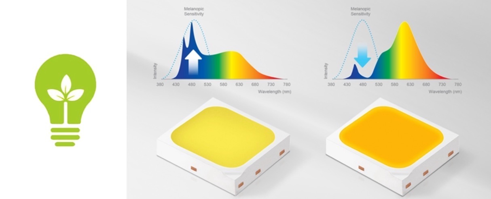
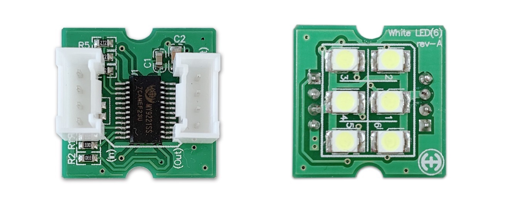
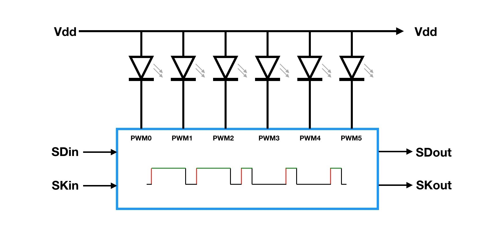
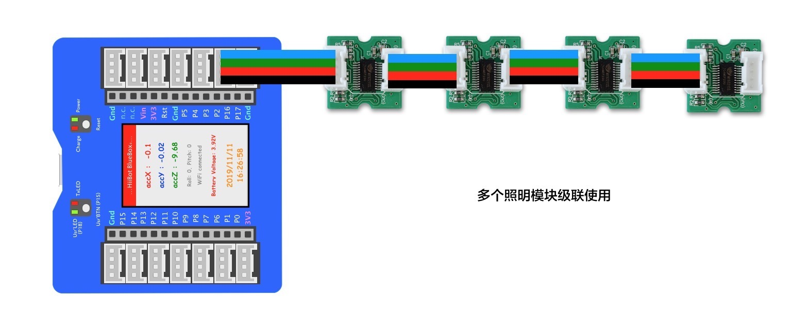
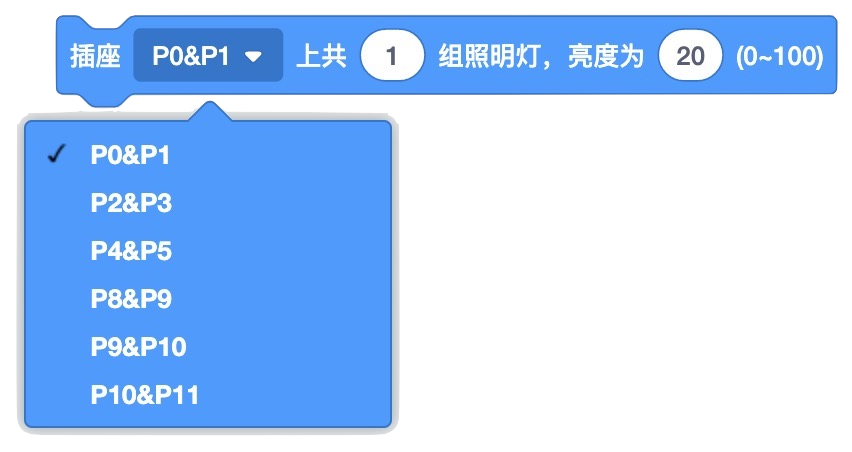

.. _Grove_A7_WhiteLightingModule:

======================
照明模块(可级联白光照明灯)
======================

LED，一种体积极小的半导体发光器件，单颗普通LED的亮度仅相当于一只萤火虫发出的光。当大量萤火虫聚集在河边时，他们一起亮起来足可以照亮几公里长的河岸。
人类在研究半导体发光技术的过程中，与萤火虫的研究相伴而行。萤火虫是如何发光的？如何让半导体器件像萤火虫一样地发出冷光？

.. _首款人本节律照明LED器件: https://www.ledinside.cn/products/20200312-47174.html

最近有媒体报道三星电子推出 `首款人本节律照明LED器件`_ 以改善室内健康生活方式。LED器件产生光，给我们以视觉识别：照明、彩光艺术等。三星电子通过半导体技术来控制LED器件发出的适合我们睡眠光谱。也就是说，人类对LED发光技术的
研究和利用已经进入非视觉效应的领域。

LED技术的开发和应用已经如此神奇，我也需要亲自研究研究。这里为你介绍一种特殊的LED照明模块，我们不仅可以通过简单编程来控制他的亮度，
还可以根据自己需要将多个照明模块级联起来使用，以达到更亮的照明需要。

为了明白多个照明模块是如何级联的，我们需要先了解一下这个模块的内部原理。

原来，每一个模块上有一个专用的PWM型LED亮度控制器，控制着6颗LED，与萤火虫相似这些LED能够发出白色冷光。我们通过两线的同步串行通讯来编程控制PWM型
LED亮度控制器，进而控制6颗LED发出不同亮度的白光。更重要的是，这个LED亮度控制器支持级联：能够将SDin和SKin信号同步地输出到SDout和SKout端。
如果我们将多个这样的照明模块级联起来，也就是将第一个模块的SDout和SKout连接到第二个模块的SDin和SKin，第二个模块的SDout和SKout连接到第三个模块
的SDin和SKin，..，我们就能获得数倍于单个模块的照明亮度。

上图是采用 `BlueBox4(蓝盒4)`_ 作为主控制器，将第一个模块的SDin和SKin信号分别于主控制器的(P2和P3)插座连接，并与其他照明模块顺序地级联起来。

.. _应用示例1: https://www.ezaoyun.com/project/cppBlockly_detail/2784
.. _易造云平台: https://www.ezaoyun.com/
.. _Scratch: https://www.ezaoyun.com:6363/
.. _BlueBox4(蓝盒4): http://www.hibottoy.com/blueBox.html

照明模块的技术参数
===============

==========  ==========
灯珠光型      冷白色
灯珠规格      3.2x5.0mm
灯珠总数      6颗
最大亮度      30流明(100%亮度时)
PWM分辨率     8-bit
刷新时间      小于1ms/次
电气接口      Grove
级联模式      支持级联
接口逻辑      3.3V/5V
供电电压      3～5V
供电电流      100%亮度时最大90mA
外型尺寸      20x20x16mm(包含插座高度)
重量         9g
==========  ==========

.. caution:: 
 * 半导体发光器件是一种将电能转换为光能的装置，发出的光越亮则消耗的电能也越多
 * 当你采用级联模式使用照明模块时，请不要想用数百甚至数千个照明模块来照亮整个体育馆，虽然在逻辑上这是可行的，但考虑到你所用主控制器的有限供电能力，实际上这是不可能的

 照明模块的用法
=============

照明模块的电气接口采用一对4线(2mm间距)的Grove接口，其中一个Grove接口为级联输入端，另一个Grove接口为级联输出端。
级联输入端的4个引脚的名称和功能如下：

========  ========  ========
1         Gnd       电源地线
2         Vdd       电源正极
3         SDin      串行数据输入
4         SKin      与串行数据同步的时钟信号输入
========  ========  ========

级联输出端的4个引脚的名称和功能如下：

========  ========  ========
1         Gnd       电源地线
2         Vdd       电源正极
3         SDout     串行数据输出
4         SKout     与串行数据同步的时钟信号输出
========  ========  ========

.. note::
 * 请务必注意区分照明模块上的两个Grove插座，一个是级联输入，另一个是级联输出，如果错误地将两者交换，模块的功能将失效
 * 级联时如果错误地将两个输入端或两个输出端连接，除了功能失效外不会引起电子元件损坏

Scrathc编程照明模块的积木块
========================

在Scratch图形化编程环境使用照明模块，仅有一个积木块

这个积木块的第一个参数：选择连接照明模块的插座位置；第二个参数，指定你用级联模式连接的模块个数；第三个参数指定所有照明模块的亮度

Arduino编程照明模块的(C/C++)API
=============================

1. 照明模块的构造器

.. code-block::

    WhiteLED(uint8_t pinClock, uint8_t pinData, uint8_t numGroup)

参数1：指定与SKin信号连接的CPU的可编程I/O引脚编号
参数2：指定与SDin信号连接的CPU的可编程I/O引脚编号
参数3：指定你所级联的照明模块个数

2. 设置所有照明模块的亮度

.. code-block::

    void setBrightness(float brightness)

参数1：指定所有照明模块的亮度(B00000000 ~ B11111111)

在Arduino环境使用照明模块
======================

我们希望使用照明模块和一个按钮结合起来实现“用按钮调光的台灯”，如下视频所示

.. image:: ../_static/video/GroveModules/Grove_A7_WhiteLightingModule/Circular11xRGBModule_1.MP4
    :align: center 

为了达成这一步，我们需要做一些准备工作。
如果你已经安装 `Arduino IDE 1.8x`_，现在首先需要安装 `BlueBox4(蓝盒4)`_ 的BSP(板级支持包)。

复制下面的 `BlueBox4(蓝盒4)`_ 的BSP链接：
https://www.ezaoyun.com:8888/hardware/bluebox4/package_bluebox4_index.json

并根据下图提示的过程维护BSP URL 

.. image:: ../_static/images/GroveModules/Grove_S16_UltrasonicDistanceMeasuringModule/Install_BB4_BSP_1.jpeg
    :align: center

然后启动Arduino的“开发板管理器”，步骤如下图所示。

.. image:: ../_static/images/GroveModules/Grove_S16_UltrasonicDistanceMeasuringModule/Install_BB4_BSP_2.jpeg
    :align: center

在弹出的"Arduino开发板管理器"窗口的搜索栏输入“BlueBox”，然后选择安装BlueBox4。

.. image:: ../_static/images/GroveModules/Grove_S16_UltrasonicDistanceMeasuringModule/Install_BB4_BSP_3.jpeg
    :align: center

一旦安装好 `BlueBox4(蓝盒4)`_ 的BSP，你就已经把照明模块的Arduino接口库安装好。

**示例1：**

.. code-block::
    :linenos:

    #include <WhiteLEDs_ESP.h>
    WhiteLED wled=WhiteLED(P4, P5, 1);
    #include <Button_ESP.h>
    Button myBtn = Button(BUILTIN_BTN, true, 10);
    float bright=1.0;
    void setup() {
        pinMode(BTN_BUILTIN, INPUT);
        bright=0.5;
        wled.setBrightness(bright);
    }
    void loop() {
        myBtn.read();
        if ( myBtn.wasPressed() ) {
                bright -= 0.1;
            if (bright < 0.1) {
                bright = 1.0;
            }
            wled.setBrightness(bright);
        }
    }

这个示例还用到另外一个库——Button，这个库已经包含在 `BlueBox4(蓝盒4)`_ 的BSP中。
使用Button库，帮助我们简化按钮的编程控制。我们在主循环程序(loop())中，调用"myBtn.read()"更新按钮的状态，
然后调用“myBtn.wasPressed()”判断是否有按钮按下，如果这个API返回true则表示有按钮按下，满足此条件时我们进行亮度调节。
如果不使用Button库，你觉得如何修改本这个示例程序并达到相同的效果？