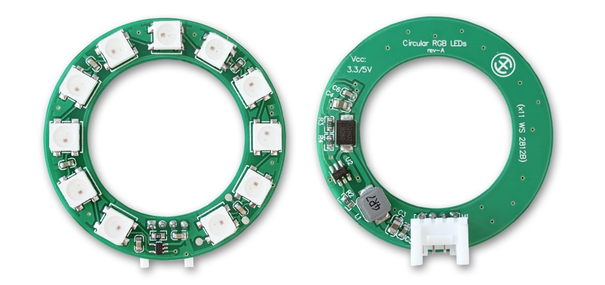
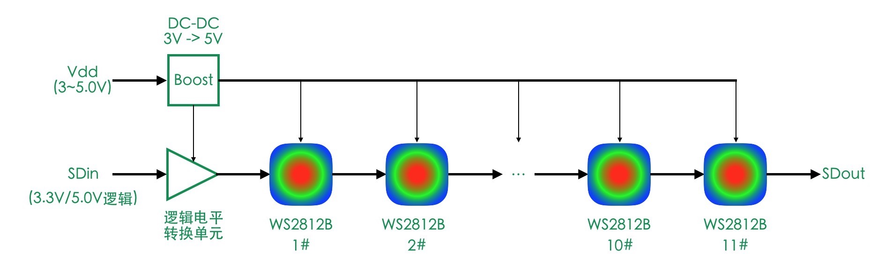
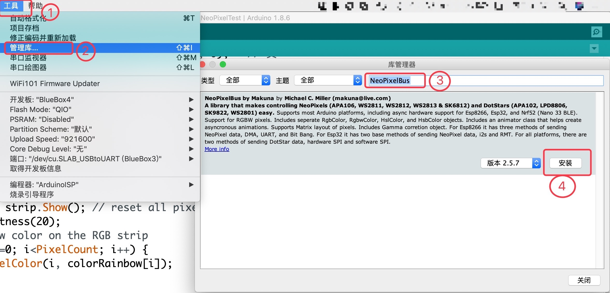

.. _Grove_A9_Circular11xRGBModule:

==========================
环形RGB彩灯模块(x11颗WS2812B)
==========================

.. note::
 * NeoPiexl，彩色像素，霓虹灯像素。我们想象一下霓虹灯，绚丽多彩、耀眼夺目、流光溢彩等形容词来表达你所想到的霓虹灯都不过分
 * RGB LED，三基色(彩色)LED。随着LED技术的发展，LED是我们生活中最重要的发光器件，而且还能发出彩光。RGB是表达彩色的常用方法，即采用独立的3个基色分量来表述颜色
 * LED节能灯，作为一种数字控制型发光器件，LED照明灯的亮度控制与传统钨丝灯泡的亮度控制可以说是革命性的。钨丝灯泡的亮度调节只是把电能消耗在其他电子元件上，照明亮度降低并不意味着降低电能消耗。然而LED节能灯的亮度降低后真正地降低电能消耗

欢迎你来到现代彩光照明时代！环形RGB彩灯模块(x11颗WS2812B)将是你探索现代照明技术和灯光艺术是最佳的选择，通过对这个模块的简单编程，
你不仅DIY一个自制的真正的可调亮度的照明灯，还能实现各种绚丽的霓虹灯效果。

她们的小包包这么酷！是怎么做到的呢？
让我们来认识一种能让包包、眼镜、头饰等发出绚烂彩光的模块：环形RGB彩灯模块。

这个模块专门为DIY可穿戴设备订制，具有很宽的供电电压范围，允许你使用2节7号电池(3.0V电压)为其供电，也可以使用标准USB数
据线或电源线的5V为其供电。外部接口逻辑电压支持3.3V和5V两种。也就是说，无论是使用micro:bit或普通Arduino开源板作为主机，
都可以控制这个环形RGB彩灯模块产生绚丽多彩的光效。

.. caution::
  * 市面上绝大多数RGB彩灯串或相似的环形彩灯，工作电压大多仅支持5V，无法与3.3V系统主控制器连接。或者仅支持3.3V供电电压，不能与5V系统连接。

环形RGB彩灯模块(x11颗WS2812B)内部的等效电路如下图。

可以看出，这个环形彩灯模块内部带有3.3V和5V系统逻辑电平转换电路单元，得益于此才能兼容两种逻辑接口。此外，内部的Boost(升压)
DC-DC单元能够将3~5V电源输入转换为稳定的5V电源输出为11颗灯珠供电。由于WS2812B灯珠采用单线自同步串行接口，这让我们很容将数百
甚至上千颗WS2812B灯珠串联起来，而且每一颗灯珠都是可以单独寻址的，也就说我们可以单独控制灯串上的某一颗灯珠的颜色，本模块虽然
只有11颗灯珠，但支持多个环形彩灯模块级联，只需要将第一个模块的SDout信号与第二个模块的SDin连接，第二个模块的SDout与第三个模块
的SDin连接，按这种规律连接电路，形成级联效果。级联使用本模块时，建议为每一个模块单独供电。

环形RGB彩灯模块的技术参数
=====================

==========  ==========
灯珠型号      WS2812B
灯珠规格      5x5mm(白面)
灯珠总数      11颗
刷新时间      小于1ms/次
颜色种类      2^24 (16777216种)
波长(R)      620~630 nm
波长(G)      515~530 nm
波长(B)      460~475 nm
电气接口      Grove
级联模式      支持级联
接口逻辑      3.3V/5V
供电电压      3～5V
供电电流      100%亮度时最大750mA
外型尺寸      外径45mm, 中孔直径29mm
重量         22g
==========  ==========

.. caution::
 * 长时间直视高亮的光源会损伤视网膜，可能会造成短暂失明！使用彩灯模块时，调节为高亮度时需要谨慎，禁止裸眼直视高亮度状态的彩灯模块
 * 环形彩灯模块消耗的电源功率(或电流)大小取决于亮度，当亮度调节为100%时，单个环形彩灯模块的工作电流高达750mA；亮度为30%时，消耗的电流仅有60mA
 * 级联模式串接多个彩灯模块时，务必为每一个模块单独供电，5V或3.3V都是允许的。这是由于本模块内部带有有限功率的DC-DC单元，不支持为级联的模块供电
 * 环形彩灯模块属于大功率外设扩展模块，禁止热插拔操作。任何热插拔操作都有可能损坏与之连接的主控制器及其供电单元！务必做到：断电连线

环形RGB彩灯模块的用法
==================

环形RGB彩灯模块的电气接口采用4线(2mm间距)的Grove接口，4个引脚的名称和功能如下：

========  ========  ========
1         Gnd       电源地线
2         Vdd       电源正极
3         nc        未使用(建议悬空)
4         SDin      自同步的数据输入信号
========  ========  ========

遵照WS2812B的接口标准，SDin信号是一种特殊的脉宽调制(0逻辑和1逻辑的脉冲周期和占空比都不相同)信号，每一颗灯珠的32位颜色和亮度信息以
低位在前高位在后的顺序传送，多颗灯珠的颜色和亮度信息则按第1颗在前的顺序传送。这么一说，或许你会觉得这种彩灯的接口时序和协议很复杂。
实际上WS2812B及其相似元件的接口时序的确比较复杂，高速时序要求每传送一个二进制位只消耗数十ns(没错！纳秒)，对于大多数非实时计算机系统
来说，单依靠CPU不可能产生如此精准的高速时序。不必担心，用搜索引擎搜索“NeoPixel library”，你会发现很多热心人帮你把这个接口的库做好了。

Scrathc编程彩灯模块的积木块
========================

Scratch积木块1: 调节彩灯模块整体亮度

.. .. image:: ../_static/images/GroveModules/Grove_A9_Circular11xRGBModule/ScratchBlocks_01.png
..     :align: center 

Arduino编程彩灯模块的(C/C++)API
=============================

1. 环形RGB彩灯模块的构造器

  使用下面的构造器声明一个名称位“strip”的彩灯模块实体

.. code-block::
    :linenos:

    // for our circular 11xRGB module, follow parameters are default
    NeoPixelBrightnessBus<NeoGrbFeature, Neo800KbpsMethod>  strip(PixelCount, PixelPin)

    // for other RGB strip, the follow sentense may be a useable matter
    //NeoPixelBrightnessBus<NeoRgbFeature, Neo400KbpsMethod>  strip(PixelCount, PixelPin)

参数1：指定灯珠个数(像素点数)，默认为11
参数2：指定与SDin连接的CPU的GPIO引脚编号
参数3(默认参数)：NeoGrbFeature，指定三基色的字节顺序，对于我们所用的WS2812B灯珠，默认选择"GRB"顺序：从高字节到最低字节顺序保存G、R、B颜色分量
参数4：Neo800KbpsMethod，指定SDin信号的波特率，这个由所用处理器的可编程I/O引脚特性决定。默认选择高速型

对于其他彩灯模块，我们所用的NeoPiexlBus接口库提供两种可选的构造器，

.. note:: 
    关于RGB和GRB三基色字节顺序
  * 目前彩色LED生产厂家对于RGB三基色组成的24位数据的字节顺序存在着相互不兼容的现象，常见的顺序有两种：RGB和GRB。也就是说，你可能会遇到“红和绿颠倒”的现象
  * RGB三基色字节顺序，最低字节(D0~D7位)表示蓝色分量，中间字节(D8~D15位)表示绿色分量，最高字节(D16~D23位)表示红色分量
  * GRB三基色字节顺序，最低字节(D0~D7位)表示蓝色分量，中间字节(D8~D15位)表示红色分量，最高字节(D16~D23位)表示绿色分量
  * 如果灯珠带有白色(即灯珠亮度信息)，则使用最高字节(D24~D31位)表示白色分量(亮度)

2. 启动RGB彩灯模块

.. code-block::

    strip.Begin()

当你开始使用彩灯模块时，这个语句必须放在Arduino的setup()函数中执行，为了复位彩灯模块，消除之前的所有数据，重新开始控制彩灯模块。

3. 将数据刷新到RGB彩灯模块

.. code-block::

    strip.Show()

在每一次更新灯珠的颜色或亮度信息之后，必须执行这个语句。执行该语句的目的是将颜色和亮度信息发送给每一个灯珠，并显示对应的颜色和亮度。
这个API非常重要，如果你的程序只是调用修改、更新灯珠的颜色或亮度信息，不使用这个API将数据传送给灯珠，你会发现自己的程序执行结果似乎不对。

4. 设置彩灯模块的亮度(整体亮度)

.. code-block::

    void SetBrightness(uint8_t brightness)

参数1：指定亮度(0~255)

.. note::
  * 设定亮度之后，彩灯模块的亮度并不会立即改变，只有下次调用"strip.show()"这个方法时新设置的亮度才会生效
  * 如果某些灯珠内部并没有专用的白色灯芯来控制灯珠亮度，也没有第四字节(亮度)信息，如何调节灯珠亮度呢？聪明的计算机科学家们借助于发光器件的物理原理也能调节亮度，亮度调节效果类似于暗红色、亮红色的区别
  * WS22812B灯珠内部没有白色灯芯，即没有专用的亮度控制单元。对于WS2812B的亮度调节，实际上是对三基色分量的值进行适当地缩放达到亮度调节目的，因此，较小的亮度间隔，或许你感觉不到亮度变化

5. 指定某个灯珠的颜色

.. code-block::

    void SetPixelColor(uint16_t indexPixel, typename T_COLOR_FEATURE::ColorObject color) 

参数1：灯珠/像素点的序号，从0开始
参数2：指定该灯珠的颜色，按照RGB或GRB三基色字节顺序的三基色分量值

.. note::
  关于颜色的表示方法
 * RGB三基色表示法，这是人们最为熟悉的几何表示法，通常可以把这个表示法想象成一个3D色彩空间，RGB三基色分别作为三维坐标轴，色彩空间的每一个点都又一个颜色值与之对应。当然，这个色彩空间本质上认识离散的点组成
 * HSV表示法，这是专业设计人员最为喜欢的一种表示法。H表示颜色，或色调；S表示饱和度；V表示亮度。其中有两种特殊情况：
   1) 亮度为0时为黑色，与色调和饱和度无关。这就相当于漆黑的夜晚，你无法判断朋友手中的彩纸到底是什么颜色；
   2) 亮度为255时为白色，与色调和饱和度无关
 * HSB表示法，与HSV相似
 * CMYK表示法，

6. 向左旋转

.. code-block::

    void RotateLeft(uint16_t rotationCount)

参数1：指定向左旋转的步数/像素点数

7. 向左移位

.. code-block::

    void ShiftLeft(uint16_t shiftCount)

参数1：指定向左移位的步数/像素点数

.. note::
  * 向左旋转，所有灯珠的颜色保持整体左转指定步数，整体上颜色不会改变
  * 向左移位，意味着最左边几颗(步数)灯珠的原始颜色被丢弃，被其右侧灯珠的原始颜色所覆盖，而右侧灯珠将熄灭
  * 下面的“向右旋转”和“向右移位”操作，除了方向不同，其余效果相同

8. 向右旋转

.. code-block::

    void RotateRight(uint16_t rotationCount)

参数1：指定向右旋转的步数/像素点数

9. 向右移位

.. code-block::

    void ShiftRight(uint16_t shiftCount)

参数1：指定向右移位的步数/像素点数

在Arduino环境使用环形RGB彩灯模块
============================

我们希望使用环形RGB彩灯模块实现“旋转的彩虹”效果，如下视频所示

.. .. image:: ../_static/video/GroveModules/Grove_A9_Circular11xRGBModule/Circular11xRGBModule_1.MP4
..     :align: center 

为了达成这一步，我们需要做一些准备工作。
如果你已经安装 `Arduino IDE 1.8x`_，现在首先需要安装 `BlueBox4(蓝盒4)`_ 的BSP(板级支持包)。

复制下面的 `BlueBox4(蓝盒4)`_ 的BSP链接：
https://www.ezaoyun.com:8888/hardware/bluebox4/package_bluebox4_index.json

并根据下图提示的过程维护BSP URL 

.. image:: ../_static/images/GroveModules/Grove_S16_UltrasonicDistanceMeasuringModule/Install_BB4_BSP_1.jpeg
    :align: center

然后启动Arduino的“开发板管理器”，步骤如下图所示。

.. image:: ../_static/images/GroveModules/Grove_S16_UltrasonicDistanceMeasuringModule/Install_BB4_BSP_2.jpeg
    :align: center

在弹出的"Arduino开发板管理器"窗口的搜索栏输入“BlueBox”，然后选择安装BlueBox4。

.. image:: ../_static/images/GroveModules/Grove_S16_UltrasonicDistanceMeasuringModule/Install_BB4_BSP_3.jpeg
    :align: center

接下来需要安装Adafruit NeoPixelBus库，请安装下图所示的步骤完成安装。

当你为Arduino IDE环境安装好 `BlueBox4(蓝盒4)`_ 的BSP和Adafruit NeoPixelBus库之后，即可实现下面的示例。

.. _应用示例1: https://www.ezaoyun.com/project/cppBlockly_detail/2784
.. _易造云平台: https://www.ezaoyun.com/
.. _Scratch: https://www.ezaoyun.com:6363/
.. _BlueBox4(蓝盒4): http://www.hibottoy.com/blueBox.html

**示例1:**

.. code-block::
    :linenos:

    #include <NeoPixelBrightnessBus.h>  // instead of NeoPixelBus.h 
    const uint16_t PixelCount = 11; // this example assumes 4 pixels, making it smaller will cause a failure
    const uint8_t PixelPin = P4;  // make sure to set this to the correct pin, ignored for Esp8266
    #define colorSaturation 255
    // for our circular 11xRGB module, follow parameters are default
    NeoPixelBrightnessBus<NeoGrbFeature, Neo800KbpsMethod>  strip(PixelCount, PixelPin);
    // define the rainbow color:
    RgbColor red(colorSaturation, 0, 0);                    // 赤
    RgbColor orange(colorSaturation, colorSaturation/2, 0); // 橙
    RgbColor yellow(colorSaturation, colorSaturation, 0);   // 黄
    RgbColor green(0, colorSaturation, 0);                  // 绿
    RgbColor cyan(0, colorSaturation, colorSaturation);     // 青
    RgbColor blue(0, 0, colorSaturation);                   // 蓝
    RgbColor purple(colorSaturation, 0, colorSaturation);   // 紫
    // define the rainbow color RGB strip 
    RgbColor colorRainbow[PixelCount] = 
            {red, orange, yellow, green, cyan, blue, purple, 
            red, orange, yellow, green};

    void setup() {
        strip.Begin(); strip.Show(); // reset all pixels
        strip.SetBrightness(20);
        // show rainbow color on the RGB strip
        for (uint8_t i=0; i<PixelCount; i++) {
            strip.SetPixelColor(i, colorRainbow[i]);
        }
        strip.Show();
    }
    void loop() {
        strip.RotateRight(1);
        strip.Show();
        delay(200);
    }

首先，将环形RGB彩灯模块连接在 `BlueBox4(蓝盒4)`_ 的(P4和P5)插座，并用USB数据线与你的电脑连接好。
然后，复制上面的示例代码，点击“编译并下载”按钮，即可看到该示例的效果：旋转的彩虹。