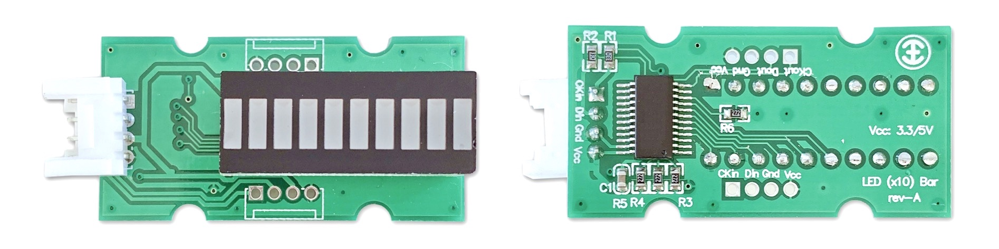
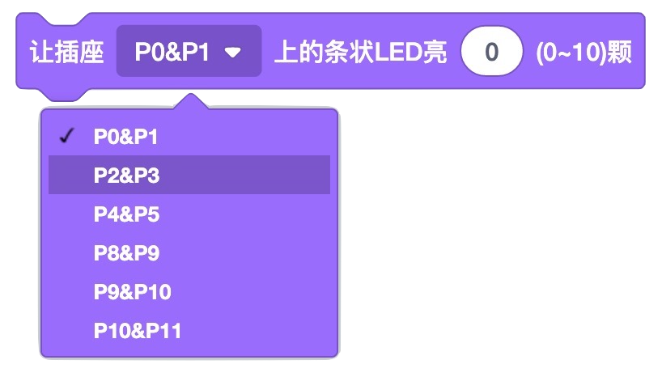
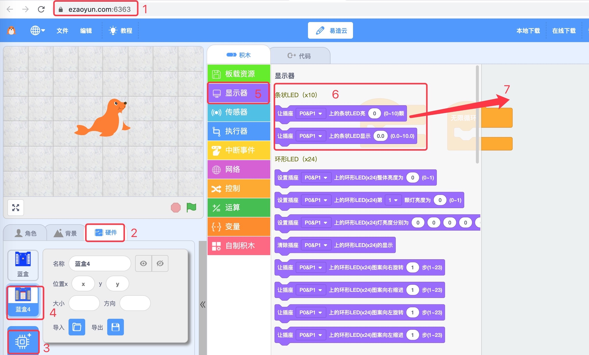
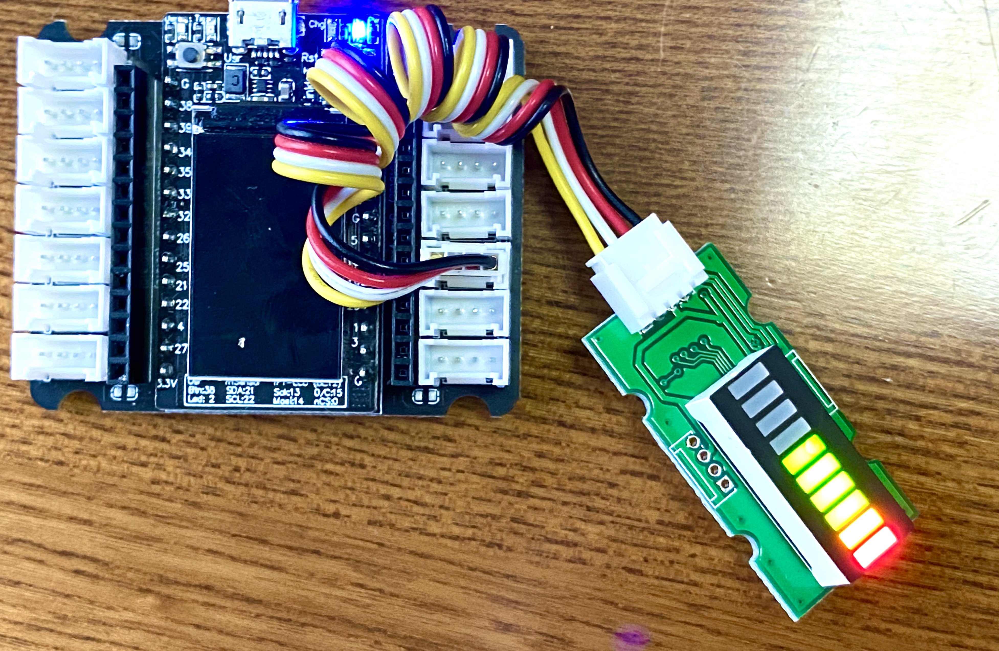
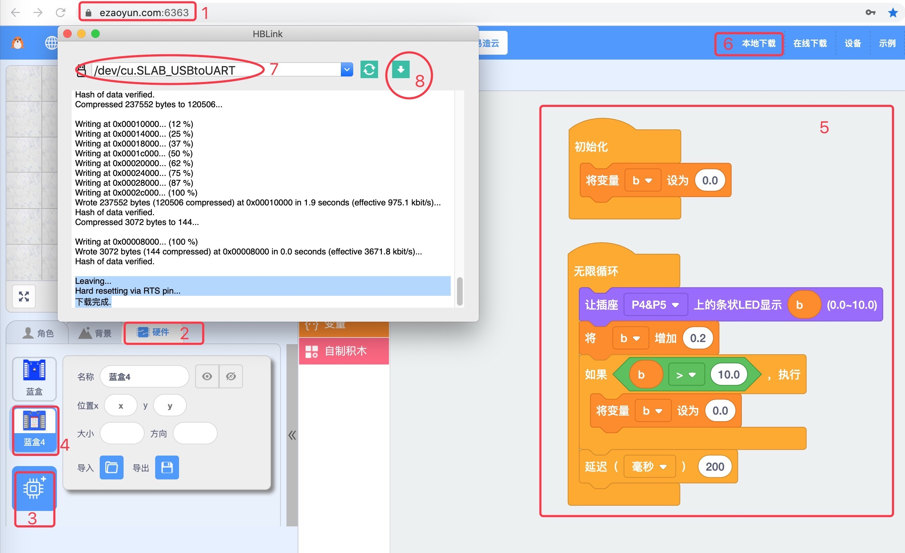
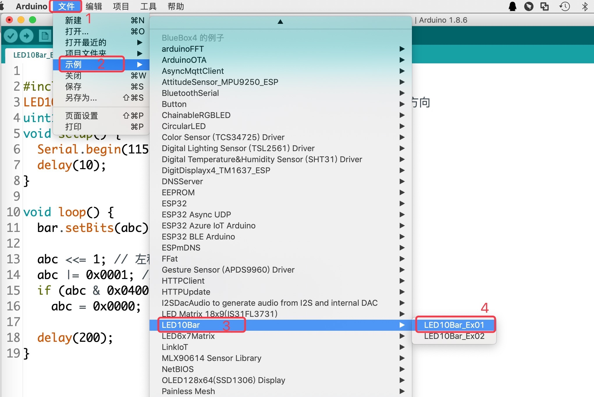

.. _Grove_D1_LEDx10BarModule:

================================
条状LED显示器模块
================================

这是一种由10颗单色的、亮度可调节的LED组成的条状显示器模块。用于各类进度状态、电量多少、距离远近等信息显示。
这个条状显示器模块采用4线2mm间距的Grove接口，使用2线同步串行控制每一个LED的亮度，使用我们提供的驱动库，
可以显示0.0~10.0之间浮点数，你将会发现5.2和5.6之间的区别：前5颗LED全亮，第6颗LED的亮度完全不同。

.. note::
    * 条状LED显示器由1颗红色LED、1颗黄色LED和8颗绿色LED组成
    * 条状LED显示器的显示方向分两种：绿->红，or 红->绿。C/C++库带有专用设置接口的API，Scratch环境默认使用"红->绿"

条状LED显示器模块的技术参数
============================

条状LED显示器模块，由8颗绿色、1颗黄色和1颗红色可调亮度的LED组成，模块内建10级PWM型LED控制器，采用4线Grove接口，且支持级联扩展。
注意，预留的级联扩展接口需要用户自行焊接4线2mm间距的Grove母座。

==========  ====================================
LED颜色      绿、黄、红三色顺序排列
LED规格      5.0x1.2mm
LED总数      10颗
亮度分级      10级
亮度调节      PWM方式
刷新时间      小于1ms/次
级联扩展      支持级联扩展(需自行焊接Grove母座)
电气接口      Grove
接口逻辑      3.3V/5V
供电电压      3～5V
供电电流      100%亮度时最大20mA
外型尺寸      10x20x15mm
重量         5g
==========  ====================================

条状LED显示器模块的用法
=======================

条状LED显示器模块的电气接口采用一对4线(2mm间距)的Grove接口，4个引脚的名称和功能如下：

========  ========  ========
1         Gnd       电源地线
2         Vdd       电源正极
3         SDin      串行数据输入
4         SKin      与串行数据同步的时钟信号
========  ========  ========

带有2个级联扩展接口位置，用户可根据自己的需要自行焊接Grove(2mm间距)母座。

Scratch编程控制条状LED显示器模块的积木块
=========================================

在Scratch图形化编程环境，共有两种积木块用于对条状LED显示器模块进行编程。
第1种以10颗LED开关模式指示 (0) 1，2，..，10 等11个进度状态；第2种以10颗LED各自按10级可调亮度模式指示(0.0)，0.1，0.2，..，0.9，1.0，1.1，..，(10.0) 等101个进度状态。
显然，第1种积木块的进度分辨率仅10格，第2种积木块提供更高分辨率的进度，总计100格。

1. 让条状LED显示器亮起若干颗(0~10颗)

2. 让条状LED显示器显示浮点数(范围：0.0~10.0)

Arduino编程控制条状LED显示器模块的(C/C++)API
=========================================

1. 条状LED显示器模块的构造器

.. code-block::

    LED10Bar(uint8_t pinClock, uint8_t pinData, bool greenToRed)

参数1: 指定与SKin连接的GPIO引脚编号；
参数2: 指定与SDin连接的GPIO引脚编号；
参数3: 指定显示方向“绿->红”(默认) 或“红->绿”。

2. 指定条状LED显示器模块的显示方向

.. code-block::

    void setGreenToRed(bool greenToRed)

功能: 指定条状LED显示器模块的显示方向；
参数1: 指定显示方向。greenToRed=true，选择“绿->红”；greenToRed=false，选择"红->绿"；
返回值: none。

3. 条状LED显示器模块显示指定数值

.. code-block::

    void setBits(uint16_t bits)

功能: 条状LED显示器模块显示指定数值；
参数1: 使用0x000~0x3FF中的最低10个二进制位控制某些LED显示；
返回值: none。

  用法示例：
.. code-block::
    :linenos:

    bar.setBits( (0x03FF)>>(10-1) ) ; // 显示1颗LED    
    bar.setBits( (0x03FF)>>(10-2) ) ; // 显示2颗LED    
    bar.setBits( (0x03FF)>>(10-5) ) ; // 显示5颗LED    
    bar.setBits( (0x03FF)>>(10-8) ) ; // 显示8颗LED    

由于条状LED显示器仅有10颗LED，使用10个二进制位来控制他们的亮/灭，最低位与第1颗LED对应，次低位与第2颗LED对应，..。
我们对 0x03FF 右移若干位的操作，目的是让高位对应的若干LED灯灭掉，如 0x03FF>>3 得到0x007F，这样仅显示低7位对应的LED。

4. 条状LED显示器模块显示浮点数 (0.0~10.0)

.. code-block::

    void setLevel(float level)

功能: 条状LED显示器模块显示浮点数 (0.0~10.0)；
参数1: 指定带显示的浮点数，有效值范围：0.0~10.0。注意，5.2与5.6的显示效果是不同的；
返回值: none。

在Scratch环境使用条状LED显示器模块
================================

 应用示例1: 

我们浏览器中打开 `易造云平台`_ (https://www.ezaoyun.com/)，在主页面的工具栏中选择 `Scratch`_ 将会打开在线版
Scratch编程环境。这个在线版Scratch编程环境不仅完全兼容MIT版的Scratch3，还支持硬件编程。换句话说，你可以使用自己熟
悉的Scratch图形化编程语言进行编程来控制计算机硬件，与计算机硬件交互。譬如，我们可以用Scratch编程控制条状LED显示器。

首先，我们看看Scratch编程环境中的条状LED显示器模块的积木块位置。在Scratch编程环境的角色选择区，点击“硬件”标签，然后点击“添加硬件”标签，
在打开的硬件选择窗口中选择 `BlueBox4(蓝盒4)`_ 。这一步操作类似于“添加角色”。接着，打开“显示器“积木抽屉，滚动鼠标滑轮，
你将会看到”条状LED (x10)“类积木块，其中包含有2种不同功能的积木块，如前所述。

然后，我们来看一个简单的条状LED显示器模块应用示例，循环显示0.0~10.0进度条。
编程之前，我们首先连接好电路：用专用4芯线将条状LED显示器模块与 `BlueBox4(蓝盒4)`_ 主控制器的(P4和P5)插座连接；然后使用USB数据线
将主控制器与编程的电脑连接。

实现这一任务目标的Scratch积木块程序如下图。

当你把本例程序编写完毕后，按上图的数字指定的步骤，将本示例程序下载到 `BlueBox4(蓝盒4)`_ 主控制器。动手试一试吧！

.. _Arduino IDE 1.8x: www.arduino.cc
.. _易造云平台: https://www.ezaoyun.com/
.. _Scratch: https://www.ezaoyun.com:6363/
.. _BlueBox4(蓝盒4): http://www.hibottoy.com/blueBox.html

在Arduino环境使用条状LED显示器模块
===============================

如果你已经安装 `Arduino IDE 1.8x`_ 只需要安装 `BlueBox4(蓝盒4)`_ 的BSP(板级支持包)即可实现下面的示例。

复制下面的 `BlueBox4(蓝盒4)`_ 的BSP链接：
https://www.ezaoyun.com:8888/hardware/bluebox4/package_bluebox4_index.json

并根据下图提示的过程维护BSP URL 

.. image:: ../_static/images/GroveModules/Grove_S16_UltrasonicDistanceMeasuringModule/Install_BB4_BSP_1.jpeg
    :align: center

然后启动Arduino的“开发板管理器”，步骤如下图所示。

.. image:: ../_static/images/GroveModules/Grove_S16_UltrasonicDistanceMeasuringModule/Install_BB4_BSP_2.jpeg
    :align: center

在弹出的"Arduino开发板管理器"窗口的搜索栏输入“BlueBox”，然后选择安装BlueBox4。

.. image:: ../_static/images/GroveModules/Grove_S16_UltrasonicDistanceMeasuringModule/Install_BB4_BSP_3.jpeg
    :align: center

或许你在想，使用条状LED显示器模块，为啥要安装 `BlueBox4(蓝盒4)`_ 的BSP?
这个BSP包含有条状LED显示器模块的C++库！当你安装好 `BlueBox4(蓝盒4)`_ 的BSP之后，就可以直接使用条状LED显示器模块了。

 应用示例2:

这个示例也是条状LED显示器模块的Arduino库自带的，按下图所述过程打开该示例。

实现本示例需要你首先使用专用4芯线将条状LED显示器模块与 `BlueBox4(蓝盒4)`_ 的(P4和P5)插座连接。
程序下载到 `BlueBox4(蓝盒4)`_ 主控制器后，你会发现模拟进度条的效果。

该示例程序的源码如下：

.. code-block::
    :linenos:

    #include <LED10Bar_ESP.h>
    LED10Bar bar=LED10Bar(P4, P5, false); // 选择"红->绿"显示方向
    uint16_t abc=0x0001;
    void setup() {
        Serial.begin(115200);
        delay(10);
    }

    void loop() {
        bar.setBits(abc);

        abc <<= 1; // 左移1位
        abc |= 0x0001; // 最低位设置为1
        if (abc & 0x0400) // 如果D10位为1, 则重置abc
            abc = 0x0000;

        delay(200);
    }

.. note::
    * 移位操作，根据移动方向分为两种：右移和左移
    * 向右移1位操作，最低位信息被丢弃，那么移入最高位的是什么？是逻辑“0”。向右移n位时，右边的n个最低位被丢弃，最高位用n个0补上
    * 向左移1位操作，最高位信息被丢弃，那么移入最低位的是什么？是逻辑“0”。向左移n位时，左边的n个最高位被丢弃，最低位用n个0补上

