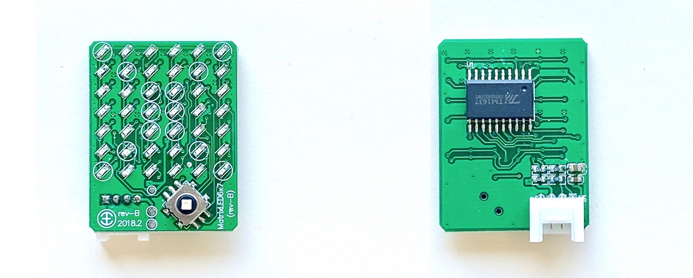
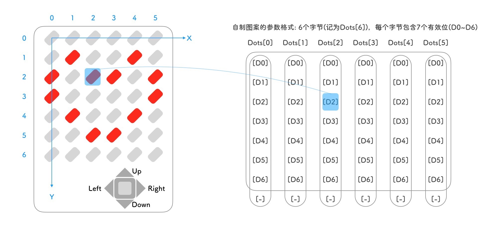
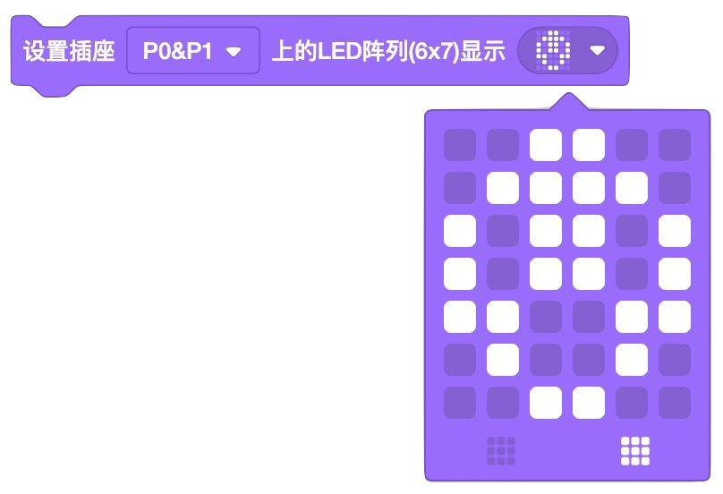
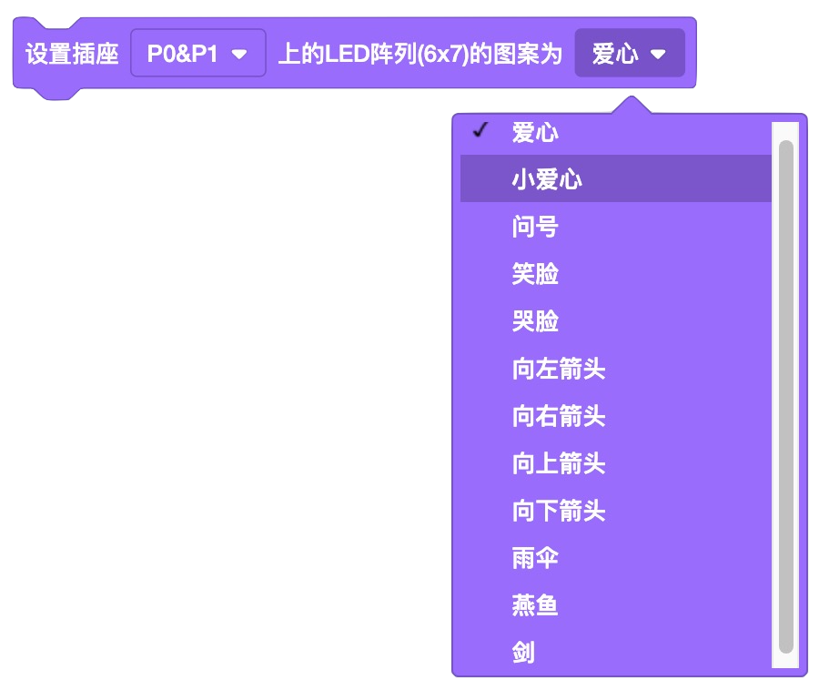
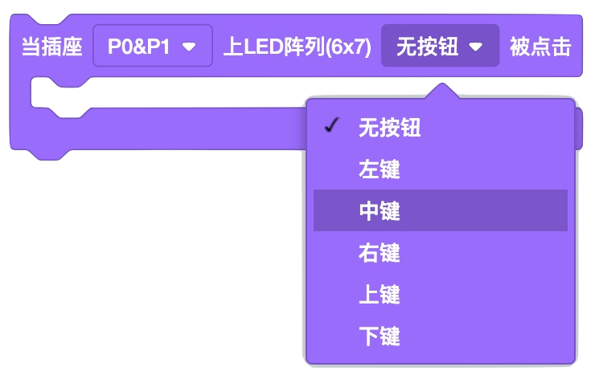
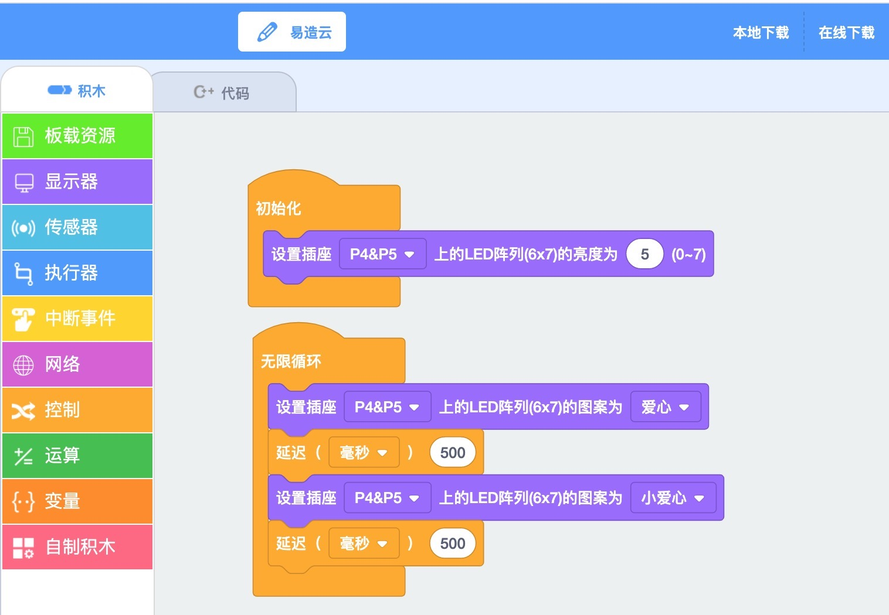
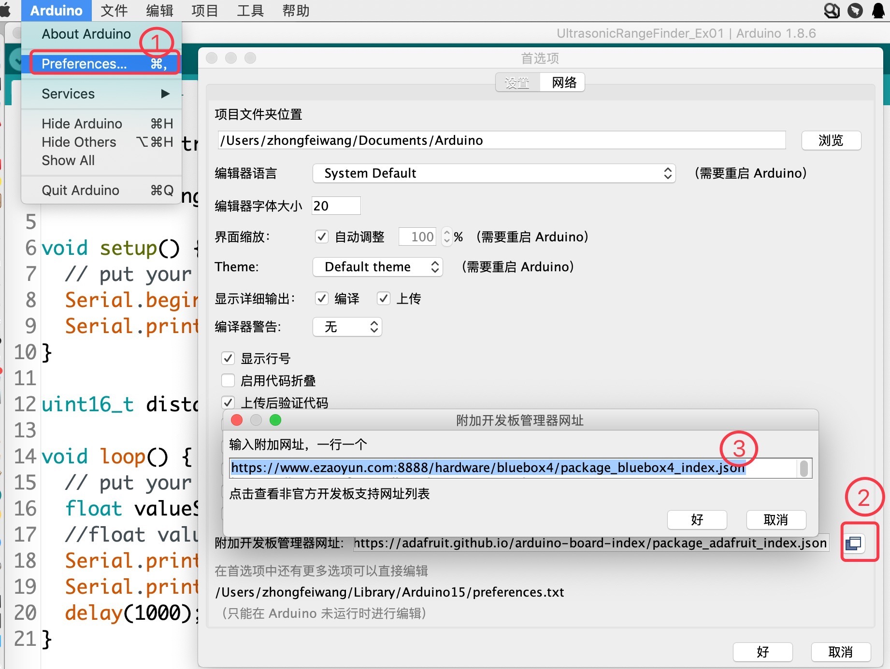
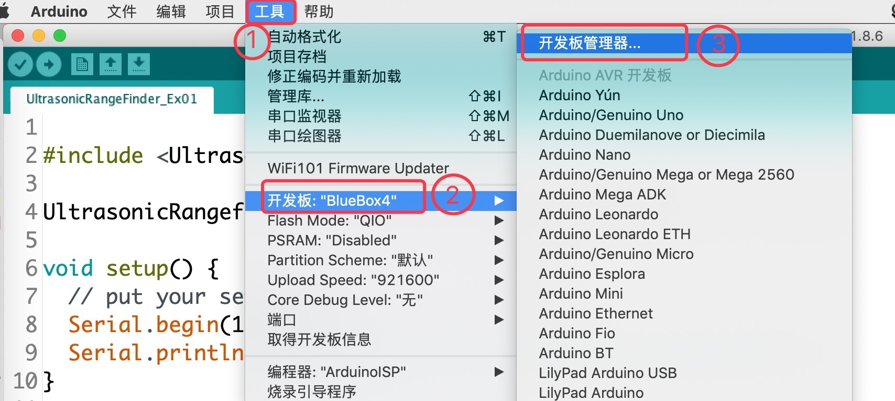
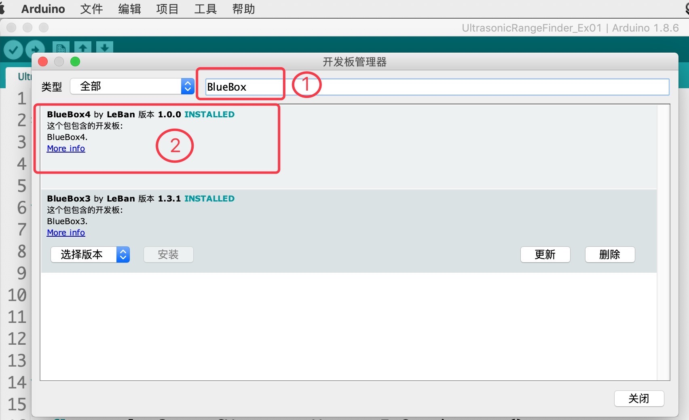

.. _Grove_D2_LED6x7MatrixModule:

============================
LED阵列显示器模块(6x7点阵)
============================

这是一个很酷的模块，不仅具有6x7排列的可调亮度的42颗LED构成的点阵显示器，并带有一个mini型5向按钮。
利用这个模块，加上任意一个具有Grove接口的主控制器，相信你很快就设计出自己的俄罗斯方块、贪吃蛇之类的经典游戏机。

使用这个显示器模块及其软件接口，你可以实现标准5x7点阵的数字、字母、符号显示，也可以显示我们在接口库中预制的图案，
譬如心、箭头等，接口库还支持自制图案。调用接口库显示两个及以上的数字、字母和符号串时，自动滚屏显示。显示器的整体亮度可调(7级)。

使用这个显示器模块，不仅能帮助你实现各种有趣的创意作品，期间你将掌握现代点阵数字显示器的基本工作原理。在我们今天的生活中，
点阵显示器无处不在，从手环到手机，从电饭煲到电视机，从家电到计算机，几乎都使用点阵显示器。他们是如何工作的呢？

6x7LED阵列显示器的组成原理
===============================

由42颗LED呈6x7阵列形式排布。6列，每列含7颗LED，这与2号西文字体的5x7点阵完全相同，并预留一列作为字符之间间隔。
6列LED的亮/灭对应一个二进制位来控制，对应位置1则亮，清零则灭。

点阵显示器的每一个点(Dot)也被称作一个像素(Pixel)，对于这样一个仅有42-Dot的点阵显示器只有42个像素，我们只需要6个
字节的存储空间即可保存整个显示内容，譬如你要自制一幅图案，只需要对Dots[6]中的42个有效二进制位进行编程。
而我们今天常用的计算机显示器大多数由1080*1920=2073600个像素组成，我们常说的4K高清电视机显示器也是这个分辨率。
高达二百多万个像素的显示器，与仅有42个像素的6x7LED阵列显示器模块相比，显示控制的原理上是相同的。但是，像素点越多就要消耗
更多的存储空间，像素点越多刷屏时间会越长，想要达到人眼可接受的60Hz刷新率，则意味着像素点越多的显示器对计算机CPU的速度要求
也越高。

显然，6x7LED阵列显示器模块仅相当于黑白的计算机点阵显示器。彩色显示器的每一个像素点的颜色信息都是可编程控制的，而黑白显示器
的像素点只有亮/灭控制。

6x7LED阵列显示模块的技术参数
========================

========    ========    ========
指标         参数         备注
分辨率       6x7阵列      42个像素
亮度        8级可调      整体调节，不支持单像素亮度调节
LED颜色     红或绿
方向按钮     5向
电气接口     Grove
逻辑电压     3.3V
供电电压     3～5V
供电电流     20mA
外型尺寸     29x37mm
重量        18g
========    ========    ========

.. note:: 
    * 5向按钮的操作识别必须与显示器刷新保持同时使用，无法单独使用5向按钮。可以关闭显示内容进行刷新
    * 8级亮度调节不是线性的，根据使用环境的亮度自行编程调节显示亮度，0亮度即关闭显示，7亮度最大

6x7LED阵列显示模块的用法
=====================

6x7LED显示器模块的电气接口采用4线(2mm间距)的Grove接口，4个引脚的名称和功能如下：

========  ========  ========
1         Gnd       电源地线
2         Vdd       电源正极
3         SDio      串行输入和输出
4         SKin      与SDio同步的时钟信号
========  ========  ========

这个模块的串行接口不是I2C/Two-Wire接口，虽然也是采用一对信号线：串行数据输入和串行时钟输入。与I2C相比较，
该模块所用的同步串行通讯接口更为简单。向显示器发送指令时，保持SKin为低电平并根据显示内容驱动SDio信号为1或0状态，
然后让SKin变为高电平，此时显示器内部单元电路会接收这个显示位信息，然后SKin回到低电平，重复上述步骤发送下一个位。

Scratch编程6x7LED阵列显示器的积木块
===============================

Scratch积木块1: 清屏或填满屏幕

.. image:: ../_static/images/GroveModules/Grove_D2_LED6x7MatrixModule/ScratchBlocks_01.png
    :align: center 

Scratch积木块2: 编辑并显示自制图案

在弹出的小窗口中，点击按照6x7点阵排列的图标，可以编辑自制的图案

Scratch积木块3: 控制屏幕的显示亮度(默认亮度为3)

Scratch积木块4: 显示预制的图案，从下拉框中选择即可

Scratch积木块5: 显示西文字符串(自动滚屏显示)

Scratch积木块6: 显示数值(自动滚屏显示)

Scratch积木块7: 指定(x, y)坐标点处的像素点亮

Scratch积木块8: 指定(x, y)坐标点处的像素点灭

Scratch积木块9: 侦测5向按钮状态，当按钮被按下时，执行某些程序

Arduino编程6x7LED阵列显示器的(C/C++)API
=====================================

1. 6x7LED阵列显示模块的构造器

.. code-block::

    LED6x7Matrix(uint8_t pinClk, uint8_t pinDIO)

参数1: 指定与SKin连接的GPIO引脚编号
参数2: 指定与SDio连接的GPIO引脚编号

用法示例：

.. code-block::

    LED6x7Matrix  display=LED6x7Matrix(P4, P5); // 显示器连接在BlueBox4的(P4和P5)插座上

2. 设置屏幕亮度

.. code-block:: 

    void setBrightness(uint8_t brightness)

参数1: 指定亮度，8级亮度的有效取值范围: 0~7

3. 清屏

.. code-block:: 

    void clearAllDots(void)

4. 填充屏幕

.. code-block:: 

    void setAllDots(void)

5. 显示自制图案

.. code-block:: 

    void setDots(const uint8_t dots[], uint8_t length = 6, uint8_t pos = 0)

参数1: 6字节的数组，该数组保存有完整的图案信息。每一个二进制位，0:该位灭；1:该位亮
参数2(可选): 指定dots[]数组的字节个数，默认为6字节，可以不需要该参数
参数3(可选): 指定起始列(0~5)，默认为第0列(显示器最左边)，可以不需要该参数

用法示例：

.. code-block::

    uint8_t Dots[6] = {B00011100,
                       B00100010,
                       B01000100,
                       B01000100,
                       B00100010,
                       B00011100}; // ❤️型图案
    setDots(Dots);

6. 显示预制图案

.. code-block:: 

    void showFixedPattern(uint8_t pn)

参数1: 指定预制图案的编号，有效取值范围0~11，共12种预制图案

7. 显示西文字符串

.. code-block:: 

    void printText( String txt, bool waitingdone=true)
    void printText( uint8_t txt[], uint8_t numTxt, bool waitingdone=true)

参数1: 待显示的字符串，有两种选择：(1) String型；(2) 字符数组
参数2: 如果第一个参数是字符型数组，这个参数指定数组的长度
参数3(可选): 指定是否自动滚屏显示，默认为自动滚屏显示，除非你将这个参数设为false

用法示例(显示String型字符串)：

.. code-block::
    :linenos:

    #include <LED6x7Matrix_ESP.h>
    LED6x7Matrix  screen=LED6x7Matrix(P4, P5); // 显示器连接在BlueBox4的(P4和P5)插座上
    String st = "Hello World";
    void setup() {
        screen.printText( st );
    }
    void loop() {
        static uint8_t cnt=0;
        screen.printText( st + String(cnt) );  // 滚屏显示内容：Hello World 120
        cnt++; // 计数器自增1
    }

8. 显示数值(或变量的值)

.. code-block:: 

    void printNumber(bool number, bool waitingdone=true)
    void printNumber(uint8_t number, bool waitingdone=true)
    void printNumber(int8_t number, bool waitingdone=true)
    void printNumber(uint16_t number, bool waitingdone=true)
    void printNumber(int16_t number, bool waitingdone=true)
    void printNumber(uint32_t number, bool waitingdone=true)
    void printNumber(int32_t number, bool waitingdone=true)
    void printNumber(float number, bool waitingdone=true)
    void printNumber(double number, bool waitingdone=true)

参数1: 待显示的数值或变量值，我们有9种选择：布尔型、8/16/32位长的带符号或不带符号型、单/双精度的浮点数
参数2(可选): 指定是否自动滚屏显示，默认为自动滚屏显示，除非你将这个参数设为false

用法示例(显示8位计数器的值)

.. code-block::
    :linenos:

    #include <LED6x7Matrix_ESP.h>
    LED6x7Matrix  screen=LED6x7Matrix(P4, P5); // 显示器连接在BlueBox4的(P4和P5)插座上
    uint8_t counter = 0;
    void setup() {
        
    }
    void loop() {
        screen.printNumber( counter );  // 滚屏显示内容：变量counter的值
        counter++; // 变量counter自增1
        delay(500);
    }

9. 让指定坐标点(x, y)的像素变为亮/灭

.. code-block:: 

    void drawDot(uint8_t x, uint8_t y, bool on=true)

参数1: 像素点的x坐标，有效取值范围：0~5
参数2: 像素点的y坐标，有效取值范围：0~6
参数3: true (默认)： 像素点亮；false：像素点灭

10. 切换指定坐标点(x, y)的像素状态

.. code-block:: 

    void toggleDot(uint8_t x, uint8_t y)

参数1: 像素点的x坐标，有效取值范围：0~5
参数2: 像素点的y坐标，有效取值范围：0~6

11. 读取并返回5向按钮的状态

.. code-block:: 

    uint8_t scanKey(void)

返回值: 5向按钮的状态。 0: 无按钮按下；1: 向左按下；2: 中间被按下；3: 向右按下；4: 向上按下；5: 向下按下

用法示例(用上下左右按钮控制一个像素点上下左右移动)

.. code-block::
    :linenos:

    #include <LED6x7Matrix_ESP.h>
    #define xMAX  5
    #define yMAX  6
    LED6x7Matrix  screen=LED6x7Matrix(P4, P5); // 显示器连接在BlueBox4的(P4和P5)插座上
    uint8_t x=2, y=3;
    void setup() {
        screen.clearAllDots(); 
        toggleDot(x,y);
    }
    void loop() {
        uint8_t kn = scanKey();
        switch (kn) {
            case 0: break;
            case 1: 
                // left, -x
                toggleDot(x,y); // turn off this pixel
                if (0 != x) x--;
                toggleDot(x,y); // turn on next pixel
                break;
            case 2: break;
            case 3: 
                // right, +x
                toggleDot(x,y); // turn off this pixel
                if (xMAX != x) x++;
                toggleDot(x,y); // turn on next pixel
                break;
            case 4: 
                // up, -y
                toggleDot(x,y); // turn off this pixel
                if (0 != y) y--;
                toggleDot(x,y); // turn on next pixel
                break;
            case 5: 
                // down, +y
                toggleDot(x,y); // turn off this pixel
                if (yMAX != y) y++;
                toggleDot(x,y); // turn on next pixel
                break;
            default: break;
        }
    }

在Scratch环境使用6x7LED阵列显示器模块
=================================

应用示例1: 

我们浏览器中打开 `易造云平台`_ (https://www.ezaoyun.com/)，在主页面的工具栏中选择 `Scratch`_ 将会打开在线版
Scratch编程环境。这个在线版Scratch编程环境不仅完全兼容MIT版的Scratch3，还支持硬件编程。换句话说，你可以使用自己熟
悉的Scratch图形化编程语言进行编程来控制计算机硬件，与计算机硬件交互。譬如，我们可以用Scratch编程控制6x7LED阵列显示器实时地
显示超声波传感器的测量结果。

首先，我们看看Scratch编程环境中的6x7LED阵列显示器的积木块位置。在Scratch编程环境的角色选择区，点击“硬件”标签，然后点击“添加硬件”标签，
在打开的硬件选择窗口中选择 `BlueBox4/蓝盒4`_ 。这一步操作类似于“添加角色”。接着，打开“显示器“积木抽屉，滚动鼠标滑轮，
你将会看到”LED阵列显示器(6x7)“类，其中包含有9种不同功能的积木块，如前所述。

.. image:: ../_static/images/GroveModules/Grove_D2_LED6x7MatrixModule/ScratchBlocks_10.png
    :align: center

然后，我们来看一个简单的6x7LED显示模块应用示例，目标显示预制的“心”型图案，并让这颗心跳动起来(变大再变小，如此重复)。
编程之前，我们首先连接好电路：用专用4芯线将6x7LED阵列显示器模块与 `BlueBox4/蓝盒4`_ 主控制器的(P4和P5)插座连接；然后使用USB数据线
将主控制器与编程的电脑连接。

.. image:: ../_static/images/GroveModules/Grove_D2_LED6x7MatrixModule/LED6x7MatrixModule_4.png
    :align: center 

实现这一任务目标的Scratch积木块程序如下图。

当你把本例程序编写完毕后，最后就是测试程序的执行效果。动手试一试吧！

.. _易造云平台: https://www.ezaoyun.com/
.. _Scratch: https://www.ezaoyun.com:6363/
.. _BlueBox4(蓝盒4): http://www.hibottoy.com/blueBox.html

在Arduino环境使用6x7LED阵列显示器模块
=================================

如果你已经安装 `Arduino IDE 1.8x`_ 只需要安装 `BlueBox4(蓝盒4)`_ 的BSP(板级支持包)即可实现下面的示例。

复制下面的 `BlueBox4(蓝盒4)`_ 的BSP链接：
https://www.ezaoyun.com:8888/hardware/bluebox4/package_bluebox4_index.json

并根据下图提示的过程维护BSP URL 

然后启动Arduino的“开发板管理器”，步骤如下图所示。

在弹出的"Arduino开发板管理器"窗口的搜索栏输入“BlueBox”，然后选择安装BlueBox4。

或许你在想，使用6x7LED显示模块，为啥要安装 `BlueBox4(蓝盒4)`_ 的BSP?
这个BSP包含有6x7LED显示模块的C++库！当你安装好 `BlueBox4(蓝盒4)`_ 的BSP之后，就可以直接使用6x7LED显示模块了。

应用示例2:

这个示例也是6x7LED显示模块的Arduino库自带的，按下图所述过程打开该示例。

.. image:: ../_static/images/GroveModules/Grove_D2_LED6x7MatrixModule/LED6x7MatrixModule_3.png
    :align: center 

实现本示例的电路连接与示例1相同，6x7LED显示模块与 `BlueBox4(蓝盒4)`_ 的(P4和P5)插座连接。
程序下载到 `BlueBox4(蓝盒4)`_ 主控制器后，按下主控制器左上角的按钮(用户可编程按钮)时，6x7LED显示模块上滚动显示的数值会增加1。
该示例程序的源码如下：

.. code-block::
    :linenos:

    #include <LED6x7Matrix_ESP.h>
    LED6x7Matrix screen = LED6x7Matrix(P4, P5);
    uint8_t pinButton = BTN_BUILTIN; // Button's Pin
    uint8_t pinLED = LED_BUILTIN; // LED's Pin
    uint8_t counter = 12; // initial value
    void setup() {
        Serial.begin(115200);
        pinMode(pinButton, INPUT);
        pinMode(pinLED, OUTPUT);
        digitalWrite(pinLED, HIGH); 
        screen.printNumber(counter, true);
    }
    void loop() {
        bool stateButton = digitalRead(pinButton);
        if ( !stateButton ) {
            if ( (counter%2) == 0 ) {
                digitalWrite(pinLED, LOW);
            } else {
                digitalWrite(pinLED, HIGH);
            }
            counter++;
            screen.printNumber(counter);
            do {
                stateButton = digitalRead(pinButton);
            } while ( !stateButton );
        }
    }

在"loop"循环内，我们读取 `BlueBox4(蓝盒4)`_ 主控制器左侧的可编程按钮状态，如果侦测到按钮被按下，即

.. code-block::

    if ( !stateButton )

if 条件为真，执行这个if的程序块。首先，判断变量counter的值是否为偶数，偶数时关闭 `BlueBox4(蓝盒4)`_ 主控制器左上角的可编程指示灯，
为奇数则点亮这颗指示灯。然后将变量counter增加1，并将该变量滚动地显示在6x7LED显示器上。最后，侦测可编程按钮的是否被是否，并等待直到按钮被释放。

你打算用这个很酷的显示器模块来实现什么创意？