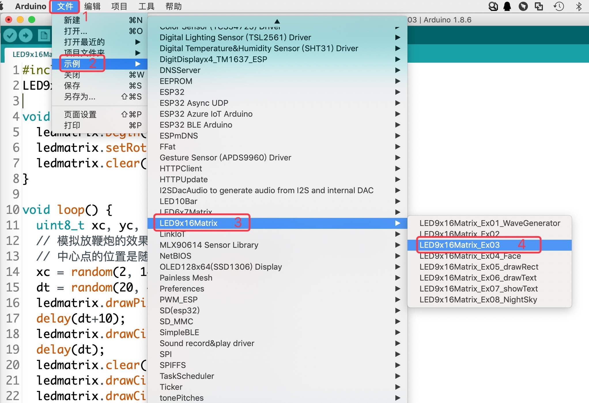

.. _Grove_D4_GreyLED9x16MatrixModule:

===========================
LED灰度阵列显示器模块
===========================

我们现在介绍一种256级灰度的9x16点阵LED阵列，不仅能滚动显示文本字符和数字，还支持画图，显示256级灰度的图片！

1. 波浪翻滚

.. image:: ../_static/images/GroveModules/Grove_D4_GreyLED9x16MatrixModule/IMG_2551.gif
    :align: center 

2. 模拟地上鞭炮爆炸效果

.. image:: ../_static/images/GroveModules/Grove_D4_GreyLED9x16MatrixModule/IMG_2552.gif
    :align: center 

3. 绘制方形图案

.. image:: ../_static/images/GroveModules/Grove_D4_GreyLED9x16MatrixModule/IMG_2553.gif
    :align: center 

4. 滚动显示字符和数字

.. image:: ../_static/images/GroveModules/Grove_D4_GreyLED9x16MatrixModule/IMG_2554.gif
    :align: center 

so funny! 

如果你拥有一个这样的显示器，相信你能创造出更有趣的效果。

LED是一种主动发光元件，用LED点阵组成的显示器不仅适合光线较暗的场合，同样适合光线明亮的场合，且视角宽至170度！
所以，我们生活中常用的各类显示器越来越多地采用LED点阵。

LED灰度阵列显示器模块的技术参数
===========================

==========  ====================================
LED颜色      红色(可订制绿、蓝等颜色)
LED规格      2.0x0.8mm
LED总数      144颗(9行16列)
LED驱动IC    IS31FK3731 (from ISSI)
亮度调节      每颗LED亮度可单独控制
亮度分级      256级
亮度调节      PWM方式
刷新时间      小于1ms/次
电气接口      Grove
通讯接口      I2C (Slave模式)
I2C地址      0x74(默认)/0x77(需要自行配置)
接口逻辑      3.3V/5V
供电电压      3～5V
供电电流      100%亮度时最大96mA
外型尺寸      36x56mm
重量         8g
==========  ====================================

.. note::
    * 每一个I2C从设备都具有一个7位地址码，在一条I2C总线内，该地址码是独占的
    * IS31FK3731的7位地址码可设置为: 0x74, 0x77。本模块默认使用0x74，你可以根据需要用烙铁焊接短路线使用0x77，请参照PCB上的指示操作

LED灰度阵列显示器模块的用法
===========================

该模块的电气接口采用4线(2mm间距)的Grove接口，4个引脚的名称和功能如下：

========  ========  ========
1         Gnd       电源地线
2         Vdd       电源正极
3         SDA       I2C的串行数据输入/输出
4         SCL       I2C的时钟信号输入
========  ========  ========

Arduino编程LED灰度阵列显示器模块的(C/C++)API
==========================================

1. LED灰度阵列显示器模块的构造器

.. code-block::

    LED9x16Matrix(uint8_t x=16, uint8_t y=9);

参数1: 指定该显示器的列数，默认为16；
参数2: 指定该显示器的行数，默认为9。

 用法示例

 .. code-block::
    :linenos:

    LED9x16Matrix  ledscr = LED9x16Matrix();

2. 初始化LED灰度阵列显示器模块

.. code-block::

    void begin(uint8_t addr=0x74)

功能: 初始化LED灰度阵列显示器模块；
参数1: 指定I2C的7位从地址，默认为0x74；
返回值: none。

 用法示例1(使用默认的从地址)

 .. code-block::
    :linenos:

    ledscr.begin();  // 使用默认的从地址：0x74

 用法示例2(使用指定的从地址)

 .. code-block::
    :linenos:

    ledscr.begin(0x77);  // 使用指定的从地址：0x77 (请注意，使用这个地址之前，请按PCB上提示用烙铁修改配置)

3. 清屏

.. code-block::

    void clear(void)

功能: 清屏，即关闭所有像素；
参数: none；
返回值: none。

4. 旋转显示方向

.. code-block::

    void setRotation(uint8_t r)

功能: 旋转显示方向；
参数1: 指定显示方向，有效值：0~3。对于本模块，0和2是有效的；
返回值: none。

5. 绘制像素点

.. code-block::

    void drawPixel(int16_t x, int16_t y, uint16_t color)

功能: 给定灰度值，绘制单个像素点；
参数1: 指定像素点的x坐标，有效值：0~15；
参数2: 指定像素点的y坐标，有效值：0~8；
参数3: 指定像素点的灰度，有效值：0~255；
返回值: none。

 用法示例(模拟夜空中星星)

.. code-block::
    :linenos:

    #include <LED9x16Matrix_ESP.h>
    LED9x16Matrix ledmatrix=LED9x16Matrix();

    // 最大间隔的灰度表
    uint8_t greyTable[9] = {0, 1, 3, 7, 15, 31, 63, 127, 255};

    void setup() {
        Serial.begin(115200);
        Serial.println();
        Serial.println("demo to LED9x16Matrix");
        ledmatrix.begin(); // 初始化LED灰度显示器
        ledmatrix.setRotation(0); // 默认显示方向
        ledmatrix.clear(); // 清屏
    }
    void loop() {
        int16_t x=random(-1, 16);
        int16_t y=random(-1, 9);
        uint8_t g=random(0, 9);
        ledmatrix.drawPixel(x, y, greyTable[g]); // 随机选择像素，显示随机灰度
        delay(100); 
    }

运行这个示例，你将会看到随机位置的LED会亮起。

.. note::
    根据上面的用法示例程序运行效果，你是否发现一个统计学上的稳定性：程序运行时间较长(至少5分钟)之后，
    屏幕上显示着的LED和灭的LED是否保持平衡？只是位置变化。如果我们能使用某种传感器测量屏幕显示亮度，
    你将会发现亮度几乎保持不变。

6. 绘制直线

.. code-block::

    void drawLine(int16_t x0, int16_t y0, int16_t x1, int16_t y1, uint16_t color)

功能: 指定的灰度和起点、终点坐标，绘制直线；
参数1: 指定直线起点的x坐标，有效值：0~15；
参数2: 指定直线起点的y坐标，有效值：0~8；
参数3: 指定直线终点的x坐标，有效值：0~15；
参数4: 指定直线终点的y坐标，有效值：0~8；
参数5: 指定像素点的灰度，有效值：0~255；
返回值: none。

7. 绘制水平直线

.. code-block::

    void drawFastHLine(int16_t x, int16_t y, int16_t w, uint16_t color)

功能: 指定的灰度和起点、长度，绘制水平直线；
参数1: 指定直线起点的x坐标，有效值：0~15；
参数2: 指定直线起点的y坐标，有效值：0~8；
参数3: 指定直线的长度，有效值：0~15；
参数4: 指定像素点的灰度，有效值：0~255；
返回值: none。

8. 绘制竖直线

.. code-block::

    void drawFastVLine(int16_t x, int16_t y, int16_t h, uint16_t color)

功能: 指定的灰度和起点、长度，绘制竖直线；
参数1: 指定直线起点的x坐标，有效值：0~15；
参数2: 指定直线起点的y坐标，有效值：0~8；
参数3: 指定直线的长度，有效值：0~15；
参数4: 指定像素点的灰度，有效值：0~255；
返回值: none。

9. 绘制矩形(边线)

.. code-block::

    void drawRect(int16_t x, int16_t y, int16_t w, int16_t h, uint16_t color)

功能: 指定的灰度和起点、宽度和高度，绘制矩形(边线)；
参数1: 指定矩形起点的x坐标，有效值：0~15；
参数2: 指定矩形起点的y坐标，有效值：0~8；
参数3: 指定矩形的宽度，有效值：0~15；
参数4: 指定矩形的高度，有效值：0~15；
参数5: 指定像素点的灰度，有效值：0~255；
返回值: none。

10. 绘制填充矩形(含边线)

.. code-block::

    void fillRect(int16_t x, int16_t y, int16_t w, int16_t h, uint16_t color)

功能: 指定的灰度和起点、宽度和高度，绘制填充矩形(含边线)；
参数1: 指定矩形起点的x坐标，有效值：0~15；
参数2: 指定矩形起点的y坐标，有效值：0~8；
参数3: 指定矩形的宽度，有效值：0~15；
参数4: 指定矩形的高度，有效值：0~15；
参数5: 指定像素点的灰度，有效值：0~255；
返回值: none。

11. 绘制圆角矩形(边线)

.. code-block::

    void drawRoundRect(int16_t x0, int16_t y0, int16_t w, int16_t h, int16_t radius, uint16_t color)

功能: 指定的灰度和起点、圆角半径、宽度和高度，绘制圆角矩形(边线)；
参数1: 指定矩形起点的x坐标，有效值：0~15；
参数2: 指定矩形起点的y坐标，有效值：0~8；
参数3: 指定矩形的宽度，有效值：0~15；
参数4: 指定矩形的高度，有效值：0~15；
参数5: 指定矩形的圆角半径，有效值：0~8且小于( min(宽度和高度)/2 )；
参数6: 指定像素点的灰度，有效值：0~255；
返回值: none。

12. 绘制填充的圆角矩形(含边线)

.. code-block::

    void fillRoundRect(int16_t x0, int16_t y0, int16_t w, int16_t h, int16_t radius, uint16_t color)

功能: 指定的灰度和起点、圆角半径、宽度和高度，绘制填充的圆角矩形(含边线)；
参数1: 指定矩形起点的x坐标，有效值：0~15；
参数2: 指定矩形起点的y坐标，有效值：0~8；
参数3: 指定矩形的宽度，有效值：0~15；
参数4: 指定矩形的高度，有效值：0~15；
参数5: 指定矩形的圆角半径，有效值：0~8且小于( min(宽度和高度)/2 )；
参数6: 指定像素点的灰度，有效值：0~255；
返回值: none。

13. 绘制圆(边线)

.. code-block::

    void drawCircle(int16_t x0, int16_t y0, int16_t r, uint16_t color)

功能: 指定的灰度和圆心坐标、半径，绘制圆(边线)；
参数1: 指定圆心的x坐标，有效值：0~15；
参数2: 指定圆心的y坐标，有效值：0~8；
参数3: 指定圆半径，有效值：0~8；
参数4: 指定像素点的灰度，有效值：0~255；
返回值: none。

14. 绘制填充圆(含边线)

.. code-block::

    void fillCircle(int16_t x0, int16_t y0, int16_t r, uint16_t color)

功能: 指定的灰度和圆心坐标、半径，绘制填充圆(含边线)；
参数1: 指定圆心的x坐标，有效值：0~15；
参数2: 指定圆心的y坐标，有效值：0~8；
参数3: 指定圆半径，有效值：0~8；
参数4: 指定像素点的灰度，有效值：0~255；
返回值: none。

15. 绘制三角形

.. code-block::

    void drawTriangle(int16_t x0, int16_t y0, int16_t x1, int16_t y1, int16_t x2, int16_t y2, uint16_t color)

功能: 指定的灰度和三个顶点坐标，绘制三角形；
参数1: 指定顶点1的x坐标，有效值：0~15；
参数2: 指定顶点1的y坐标，有效值：0~8；
参数3: 指定顶点2的x坐标，有效值：0~15；
参数4: 指定顶点2的y坐标，有效值：0~8；
参数5: 指定顶点3的x坐标，有效值：0~15；
参数6: 指定顶点3的y坐标，有效值：0~8；
参数7: 指定像素点的灰度，有效值：0~255；
返回值: none。

16. 绘制填充的三角形

.. code-block::

    void fillTriangle(int16_t x0, int16_t y0, int16_t x1, int16_t y1, int16_t x2, int16_t y2, uint16_t color)

功能: 指定的灰度和三个顶点坐标，绘制填充的三角形；
参数1: 指定顶点1的x坐标，有效值：0~15；
参数2: 指定顶点1的y坐标，有效值：0~8；
参数3: 指定顶点2的x坐标，有效值：0~15；
参数4: 指定顶点2的y坐标，有效值：0~8；
参数5: 指定顶点3的x坐标，有效值：0~15；
参数6: 指定顶点3的y坐标，有效值：0~8；
参数7: 指定像素点的灰度，有效值：0~255；
返回值: none。

17. 绘制位图图片

.. code-block::

    void drawBitmap(int16_t x, int16_t y, const uint8_t bitmap[], int16_t w, int16_t h, uint16_t color)

功能: 指定的灰度和顶点坐标，以及位图图片的宽度和高度，绘制给定的位图图片；
参数1: 指定顶点的x坐标，有效值：0~15；
参数2: 指定顶点的y坐标，有效值：0~8；
参数3: 给定的位图图片，数组；
参数4: 指定位图显示的宽度，有效值：0~15；
参数5: 指定位图显示的高度，有效值：0~8；
参数6: 指定像素点的灰度，有效值：0~255；
返回值: none。

18. 显示西文字符串

.. code-block::

    // 使用 String 类型传入字符串
    void showText(String txt, uint8_t textBrightness=20, bool waitingdone=true)
    // 使用 uint8_t 型数组和数组长度传入字符串
    void showText(uint8_t textStr[], uint8_t textStrLen, uint8_t textBrightness=20, bool waitingdone=true)

功能: 指定灰度，滚动显示指定的字符串；
参数1: 指定待显示的字符串，字符串长度不能超过32；
(参数2: 指定参数1中数组的长度；)
参数3: 指定显示的灰度，有效值：0~255，默认为20；
参数4: 指定是否滚动显示，默认为滚动显示；
返回值: none。

19. 显示数值

.. code-block::

    void showNumber( number, uint8_t textBrightness=20, bool waitingdone=true)

功能: 指定灰度，滚动显示指定的数值；
参数1: 指定待显示的数值。务必以明确的待显示数值的数据类型(uint8_t/int8_t/uint16_t/int16_t/uint32_t/int32_t/float)；
参数3: 指定显示的灰度，有效值：0~255，默认为20；
参数4: 指定是否滚动显示，默认为滚动显示；
返回值: none。

.. _Arduino IDE 1.8x: www.arduino.cc
.. _易造云平台: https://www.ezaoyun.com/
.. _Scratch: https://www.ezaoyun.com:6363/
.. _BlueBox4(蓝盒4): http://www.hibottoy.com/blueBox.html

在Arduino环境使用LED灰度阵列显示器模块
=====================================

如果你已经安装 `Arduino IDE 1.8x`_ 只需要安装 `BlueBox4(蓝盒4)`_ 的BSP(板级支持包)即可实现下面的示例。

复制下面的 `BlueBox4(蓝盒4)`_ 的BSP链接：
https://www.ezaoyun.com:8888/hardware/bluebox4/package_bluebox4_index.json

并根据下图提示的过程维护BSP URL 

.. image:: ../_static/images/GroveModules/Grove_S16_UltrasonicDistanceMeasuringModule/Install_BB4_BSP_1.jpeg
    :align: center

然后启动Arduino的“开发板管理器”，步骤如下图所示。

.. image:: ../_static/images/GroveModules/Grove_S16_UltrasonicDistanceMeasuringModule/Install_BB4_BSP_2.jpeg
    :align: center

在弹出的"Arduino开发板管理器"窗口的搜索栏输入“BlueBox”，然后选择安装BlueBox4。

.. image:: ../_static/images/GroveModules/Grove_S16_UltrasonicDistanceMeasuringModule/Install_BB4_BSP_3.jpeg
    :align: center

或许你在想，使用LED灰度阵列显示器模块，为啥要安装 `BlueBox4(蓝盒4)`_ 的BSP?
这个BSP包含有LED灰度阵列显示器模块的C++库！当你安装好 `BlueBox4(蓝盒4)`_ 的BSP之后，就可以直接使用LED灰度阵列显示器模块了。

 应用示例2:

这个示例也是LED灰度阵列显示器模块的Arduino库自带的，按下图所述过程打开该示例。

实现本示例之前，需要用专用4芯线将LED灰度阵列显示器模块与 `BlueBox4(蓝盒4)`_ 的(P6和P7)插座连接，(P6和P7)插座也就是I2C插座。
然后打开示例程序，点击“编译并下载”按钮，将程序下载到 `BlueBox4(蓝盒4)`_ 主控制器，即可看到“模拟地上鞭炮爆炸的效果”

该示例程序的源码如下：

.. code-block::
    :linenos:

    #include <LED9x16Matrix_ESP.h>
    LED9x16Matrix  ledmatrix;

    void setup() {
        ledmatrix.begin();
        ledmatrix.setRotation(0);
        ledmatrix.clear();
    }

    void loop() {
        uint8_t xc, yc, dt;
        // 模拟放鞭炮的效果，中心点最亮，依次越来越暗，中心点最先消失
        // 中心点的位置是随机的，持续时间也是随机的
        xc = random(2, 14); yc = random(2, 7);
        dt = random(20, 41);
        ledmatrix.drawPixel(xc, yc, 127);
        delay(dt+10);
        ledmatrix.drawCircle(xc, yc, 1, 64);
        delay(dt);
        ledmatrix.clear();
        ledmatrix.drawCircle(xc, yc, 2, 8);
        ledmatrix.drawCircle(xc, yc, 3, 2);
        delay(60-dt);
        ledmatrix.clear();
        delay(10);
    }

放鞭炮是我国春节的民俗，虽然现在很多城市都禁止燃放鞭炮。当本示例程序在执行期间，我们可以下载或录制一段鞭炮声做背景音，
同时播放“恭喜发财”的音乐，营造一份春节期间的新年快乐氛围。

