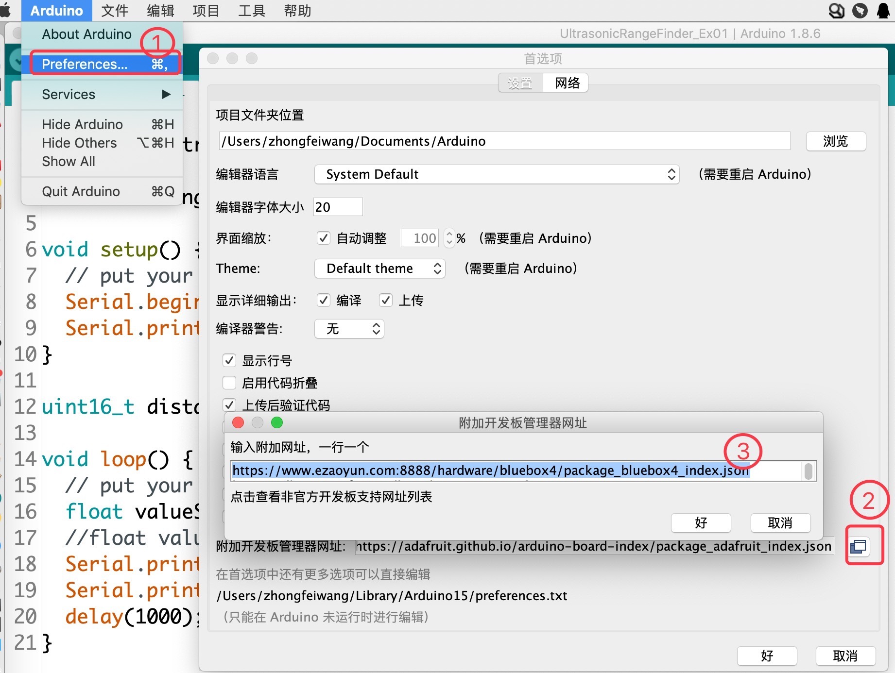
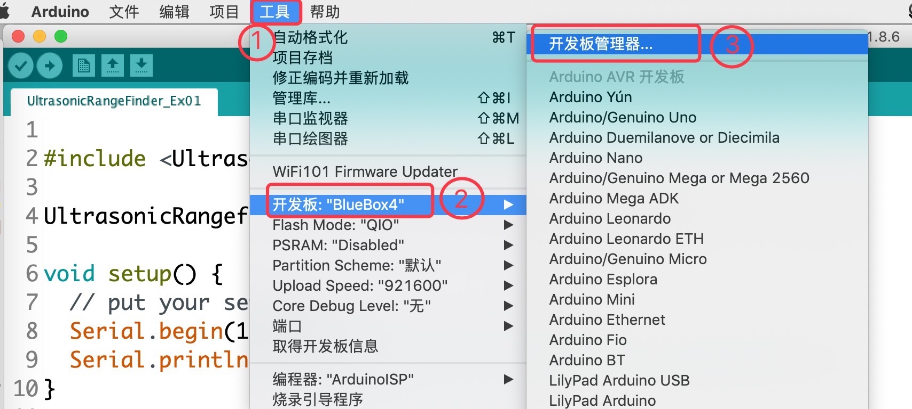
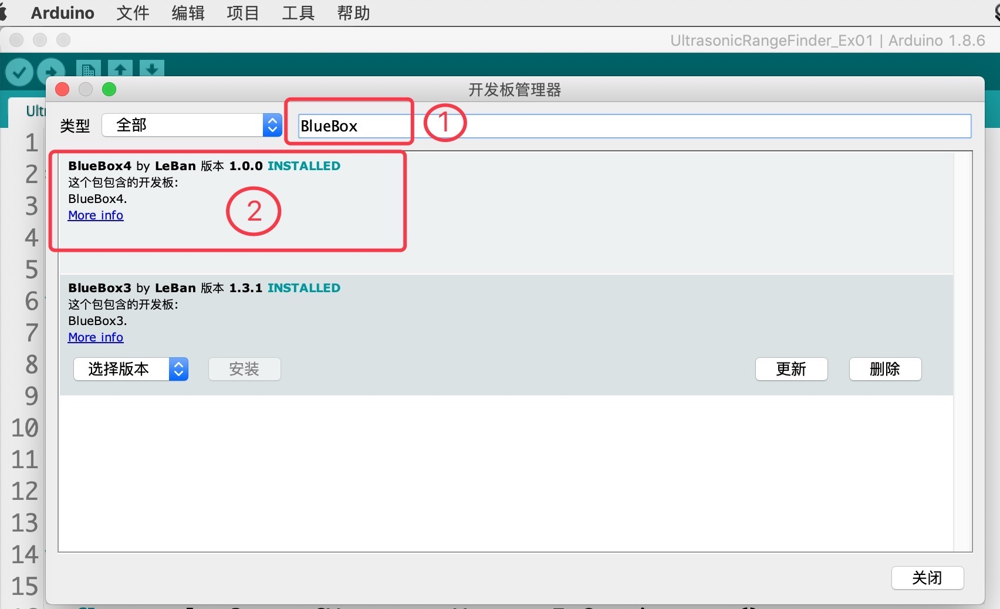

.. _Grove_D6_Circular24xLEDModule:

============================
环形LED阵列模块(x24颗)
============================

我们先来看看使用环形LED阵列模块实现的有趣效果

如何实现这个效果的程序源码，后面的章节中会给出，并分析实现的思路。
实现这个有趣效果的主角是，环形LED阵列模块(x24颗)。这个模块由24颗亮度可单独调节的LED及其控制接口电路单元组成，且24颗
LED呈环形排列，相当于手表上小时刻度的每隔半小时一颗。准确地说，每隔15度一颗LED，24颗LED正好排布在一个圆上。

.. image:: ../_static/images/GroveModules/Grove_D6_Circular24xLEDModule/CircularLEDModule_1.jpg
    :align: center 

环形LED阵列模块的技术参数
=========================

环形LED阵列模块的关键技术参数如下表：

==========  ====================================
LED颜色      绿、红、蓝三色间隔排列
LED规格      2.0x0.8mm
LED总数      24颗
亮度分级      10级
亮度调节      PWM方式
刷新时间      小于1ms/次
电气接口      Grove
接口逻辑      3.3V/5V
供电电压      3～5V
供电电流      100%亮度时最大35mA
外型尺寸      外径45mm,内方孔22x22mm,圆角半径2.54mm
重量         5g
==========  ====================================

环形LED阵列模块的用法
=====================

环形LED阵列模块的电气接口采用一对4线(2mm间距)的Grove接口，4个引脚的名称和功能如下：

========  ========  ========
1         Gnd       电源地线
2         Vdd       电源正极
3         SDin      串行数据输入
4         SKin      与串行数据同步的时钟信号
========  ========  ========

Scrathc编程控制环形LED阵列模块的积木块
=====================================

在Scratch图形化编程环境使用环形LED阵列模块，总共有8种积木块。

1. 清除/关闭环形LED阵列模块上所有LED

这个积木块仅有一个参数：选择连接环形LED阵列模块的插座位置。事实上，环形LED阵列模块的所有积木块都具有这个参数，用于定义硬件连接。

2. 设置环形LED阵列模块上所有LED的亮度

第1个参数，指定连接环形LED阵列模块的插座位置；第2个参数，指定所要设置的亮度值，有效范围:0.0~1.0，其中0.0亮度与前一个积木块的效果相同，
1.0亮度为最亮。

  用法示例：

通过这个示例，你将会看到环形LED阵列模块的所有LED的亮度从最亮渐变为熄灭，并重复这一过程。
这个示例，你将会看到环形LED阵列模块上LED的排列，亮度变化范围。完成该示例，需要你具有Scratch编程基础。
或许你完全明白Scratch变量的创建、使用，但使用环形LED阵列模块时还需要你了解“浮点数”，因为亮度设置的有效范围是0.0~1.0。

3. 设置环形LED阵列模块上某个LED的亮度

第1个参数，指定连接环形LED阵列模块的插座位置；
第2个参数，指定环形LED阵列模块上LED的位置，有效值：1~24；
第3个参数，指定所要设置的LED亮度，有效值：0.0~1.0。

与前一个积木块相比，这个积木块仅仅指定某一个LED的亮度，你可以使用该积木块替换前一个示例程序中的积木块，对单颗LED亮度进行控制。

4. 使用一组(24个)数据设置环形LED阵列模块上所有LED的亮度

.. image:: ../_static/images/GroveModules/Grove_D6_Circular24xLEDModule/Scratch_4.png
    :align: center 

第1个参数，指定连接环形LED阵列模块的插座位置；
第2～25个参数，分别指定1～24号位置LED的亮度，有效值：0.0~1.0。

与第2个积木块相比，你可以使用这个积木设置一个环形的亮度图案。只是亮度！

5. 让环形LED阵列模块上亮度图案向右旋转若干步

第1个参数，指定连接环形LED阵列模块的插座位置；
第2个参数，指定向右旋转的步数，有效值：1~23。

6. 让环形LED阵列模块上亮度图案向左旋转若干步

第1个参数，指定连接环形LED阵列模块的插座位置；
第2个参数，指定向左旋转的步数，有效值：1~23。

  用法示例：

通过这个示例，你将制作一个很炫酷的眼镜装饰品。
我们使用两个环形LED阵列模块，首先设置两幅相同的亮度图案，然后使用第5和第6种积木块控制两个模块上的图案分别向右、向左旋转。
或许你希望图案的旋转速度更快些，如何修改程序？
第1种修改方案是，减少循环中的延迟时间；第2种修改方案是，增加每次旋转的步数。
试一试效果吧！

7. 让环形LED阵列模块上亮度图案向右缩进若干步

第1个参数，指定连接环形LED阵列模块的插座位置；
第2个参数，指定向右缩进的步数，有效值：1~23。

8. 让环形LED阵列模块上亮度图案向左缩进若干步

第1个参数，指定连接环形LED阵列模块的插座位置；
第2个参数，指定向左缩进的步数，有效值：1~23。

向右旋转和向右缩进，两种效果有什么区别？请修改前一个示例的循环体内程序，你一定能完全理解“循环”和“缩进”的区别。

Arduino编程环形LED阵列模块的(C/C++)API
=====================================

1. 环形LED阵列模块的构造器

.. code-block::

    CircularLED(uint8_t pinClock, uint8_t pinData)

参数1: 指定与SKin连接的GPIO引脚编号；
参数2: 指定与SDin连接的GPIO引脚编号。

 用法示例

 .. code-block::

    CircularLED  cled = CircularLED(uint8_t P2, uint8_t P3); // 环形LED阵列模块连接在(P2,P3)插座

2. 清除/关闭环形LED阵列模块上所有LED

.. code-block::

    void clearDisplay(void)

功能: 将模块上所有LED亮度设置为0.0，即关闭显示；
参数: none；
返回值: none。

3. 设置环形LED阵列模块上所有LED的亮度

.. code-block::

    void setBrightness(float brightness)

功能: 将模块上所有LED设置为同一个指定的亮度；
参数1: 指定所要设置的亮度，有效值：0.0~1.0；
返回值: none。

  用法示例：

.. code-block:
    :linenos:

    #include <CircularLEDs_ESP.h>
    CircularLED cled = CircularLED(P2,P3);
    float b = 1.0;
    void setup()
    {
        cled.clearDisplay(); // clear display
        b = 1.0; // initialize variable b to 1.0
    }
    void loop(){
        cled.setBrightness(b); // use variable b to refresh the brightness of module
        b += -0.1; 
        if ( b < 0.1) {
            b = 1.0;
        }
        delay(200);
    }    

通过这个示例，你将会看到环形LED阵列模块的所有LED的亮度从最亮渐变为熄灭，并重复这一过程。
这个示例，你将会看到环形LED阵列模块上LED的排列，亮度变化范围。

3. 设置环形LED阵列模块上某个LED的亮度

.. code-block::

    void setBrightness(uint8_t led, float brightness)

功能: 将模块上某个LED设置为指定的亮度；
参数1: 指定所要设置的LED编号/位置，有效值：1~24
参数2: 指定所要设置的亮度，有效值：0.0~1.0；
返回值: none。

4. 用一个浮点数数组设置环形LED阵列模块上d多颗LED的亮度

.. code-block::

    void setBrightness(uint8_t startLed, uint8_t numberLed, float brightLed[])

功能: 用一个浮点数数组一次性指定多颗LED的亮度；
参数1: 指定所要设置的LED起始编号/位置，有效值：1~23
参数2: 指定所有设置的LED个数，有效值：1~24，其中（参数1+参数2）<= 25
参数3: 指定所要设置亮度的数组，有效值：0.0~1.0；
返回值: none。

5. 让环形LED阵列模块上亮度图案向右旋转一步

.. code-block::

    void rightRotate(void)

功能: 让环形LED阵列模块上亮度图案整体向右旋转1步；
参数: none；
返回值: none。

6. 让环形LED阵列模块上亮度图案向右旋转指定的步数

.. code-block::

    void rightRotate(uint8_t steps)

功能: 让环形LED阵列模块上亮度图案整体向右旋转1步；
参数1: 指定将要旋转的步数，有效值: 1~23
返回值: none。

7. 让环形LED阵列模块上亮度图案向右缩进一步

.. code-block::

    void rightShift(void)

功能: 让环形LED阵列模块上亮度图案整体向右缩进1步；
参数: none；
返回值: none。

8. 让环形LED阵列模块上亮度图案向右缩进指定的步数

.. code-block::

    void rightShift(uint8_t steps)

功能: 让环形LED阵列模块上亮度图案整体向右缩进1步；
参数1: 指定将要缩进的步数，有效值: 1~23
返回值: none。

9. 让环形LED阵列模块上亮度图案向左旋转一步

.. code-block::

    void leftRotate(void)

功能: 让环形LED阵列模块上亮度图案整体向左旋转1步；
参数: none；
返回值: none。

10. 让环形LED阵列模块上亮度图案向左旋转指定的步数

.. code-block::

    void leftRotate(uint8_t steps)

功能: 让环形LED阵列模块上亮度图案整体向左旋转1步；
参数1: 指定将要旋转的步数，有效值: 1~23
返回值: none。

11. 让环形LED阵列模块上亮度图案向左缩进一步

.. code-block::

    void leftShift(void)

功能: 让环形LED阵列模块上亮度图案整体向左缩进1步；
参数: none；
返回值: none。

12. 让环形LED阵列模块上亮度图案向左缩进指定的步数

.. code-block::

    void leftShift(uint8_t steps)

功能: 让环形LED阵列模块上亮度图案整体向左缩进1步；
参数1: 指定将要缩进的步数，有效值: 1~23
返回值: none。

  用法示例：

.. code-block::
    :linenos:

    #include <CircularLEDs_ESP.h>
    CircularLED cled1=CircularLED(P2, P3);
    CircularLED cled2=CircularLED(P4, P5);
    float ba[24] = {
            0.1, 0.2, 0.3, 0.4, 0.5, 0.6,
            0.8, 1.0, 0.0, 0.0, 0.0, 0.0,
            0.1, 0.2, 0.3, 0.4, 0.5, 0.6,
            0.8, 1.0, 0.0, 0.0, 0.0, 0.0
    };         
    void setup() {
        cled1.setBrightness(1, 24, ba);
        cled2.setBrightness(1, 24, ba);
    }
    void loop() {
        cled1.rightRotate(2);
        cled2.leftRotate(2);
        delay(50);
    }

示例程序的执行效果，如下图所示。首先，用一个数组将两个环形LED阵列模块预制一幅相同的亮度图案；
然后在循环体内，右转一个模块的图案，另一个模块的图案左转，延迟50ms。

.. image:: ../_static/images/GroveModules/Grove_D6_Circular24xLEDModule/IMG_2527.gif
    :align: center 

在Scratch环境使用环形LED阵列模块
==============================

 应用示例1: 

我们浏览器中打开 `易造云平台`_ (https://www.ezaoyun.com/)，在主页面的工具栏中选择 `Scratch`_ 将会打开在线版
Scratch编程环境。这个在线版Scratch编程环境不仅完全兼容MIT版的Scratch3，还支持硬件编程。换句话说，你可以使用自己熟
悉的Scratch图形化编程语言进行编程来控制计算机硬件，与计算机硬件交互。譬如，我们可以用Scratch编程控制环形LED阵列模块产生流光溢彩的效果。

首先，我们看看Scratch编程环境中的环形LED阵列模块的积木块位置。在Scratch编程环境的角色选择区，点击“硬件”标签，然后点击“添加硬件”标签，
在打开的硬件选择窗口中选择 `BlueBox4(蓝盒4)`_ 。这一步操作类似于“添加角色”。接着，打开“显示器“积木抽屉，滚动鼠标滑轮，
你将会看到”环形LED (x24)“类，其中包含有8种不同功能的积木块，如前所述。

然后，我们来看一个简单的环形LED阵列模块应用示例，让几颗亮度不同的LED旋转起来。
编程之前，我们首先连接好电路：用专用4芯线将环形LED阵列模块与 `BlueBox4(蓝盒4)`_ 主控制器的(P2和P3)插座连接；然后使用USB数据线
将主控制器与编程的电脑连接。

实现这一任务目标的Scratch积木块程序如下图。

当你把本例程序编写完毕后，按上图的数字指定的步骤，将本示例程序下载到 `BlueBox4(蓝盒4)`_ 主控制器。动手试一试吧！

.. _Arduino IDE 1.8x: www.arduino.cc
.. _易造云平台: https://www.ezaoyun.com/
.. _Scratch: https://www.ezaoyun.com:6363/
.. _BlueBox4(蓝盒4): http://www.hibottoy.com/blueBox.html

在Arduino环境使用环形LED阵列模块
===============================

如果你已经安装 `Arduino IDE 1.8x`_ 只需要安装 `BlueBox4(蓝盒4)`_ 的BSP(板级支持包)即可实现下面的示例。

复制下面的 `BlueBox4(蓝盒4)`_ 的BSP链接：
https://www.ezaoyun.com:8888/hardware/bluebox4/package_bluebox4_index.json

并根据下图提示的过程维护BSP URL 

然后启动Arduino的“开发板管理器”，步骤如下图所示。

在弹出的"Arduino开发板管理器"窗口的搜索栏输入“BlueBox”，然后选择安装BlueBox4。

或许你在想，使用环形LED阵列模块，为啥要安装 `BlueBox4(蓝盒4)`_ 的BSP?
这个BSP包含有环形LED阵列模块的C++库！当你安装好 `BlueBox4(蓝盒4)`_ 的BSP之后，就可以直接使用环形LED阵列模块了。

 应用示例2:

这个示例也是环形LED阵列模块的Arduino库自带的，按下图所述过程打开该示例。

实现本示例需要2个环形LED阵列模块，并用专用4芯线将两个模块分别与 `BlueBox4(蓝盒4)`_ 的(P2和P3)和(P4和P5)插座连接。
程序下载到 `BlueBox4(蓝盒4)`_ 主控制器后，按下主控制器左上角的按钮(用户可编程按钮)时，两个环形LED阵列模块上图案分别
向右和向左缩进一次。

该示例程序的源码如下：

.. code-block::
    :linenos:

    #include <CircularLEDs_ESP.h>
    #include <Button_ESP.h>
    Button Btn = Button(BUILTIN_BTN, true, 10);
    CircularLED cled1=CircularLED(P2, P3);
    CircularLED cled2=CircularLED(P4, P5);

    float b[24] = {0.1, 0.15, 0.2, 0.25, 0.3, 0.35,
                0.4, 0.45, 0.5, 0.55, 0.6, 0.65,
                0.7, 0.75, 0.8, 0.85, 0.9, 0.95,
                1.0, 0.0, 0.0, 0.0, 0.0, 0.0};

    void setup() {
        pinMode(BUILTIN_BTN, INPUT);
        cled1.setBrightness(1, 24, b);
        cled2.setBrightness(1, 24, b);
    }

    void loop() {
        Btn.read();
        if ( Btn.wasPressed() ) {
            cled1.leftShift(1);
            cled2.rightShift(1);
        }
    }

对比示例1和示例2，你将会发现“旋转”和“缩进”的区别。
