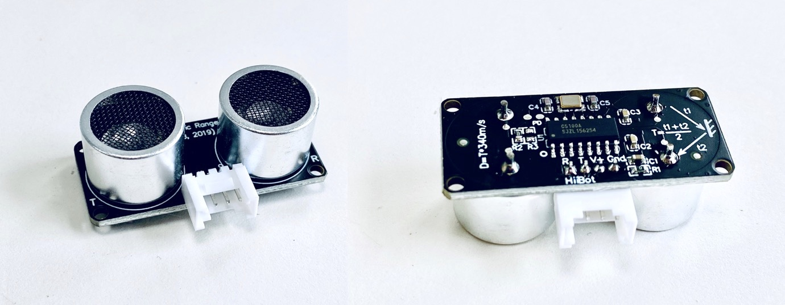
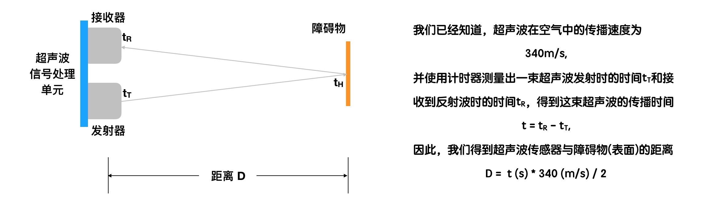
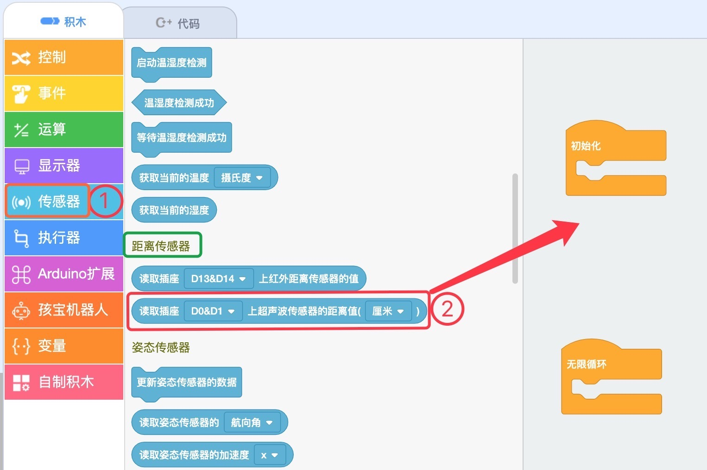
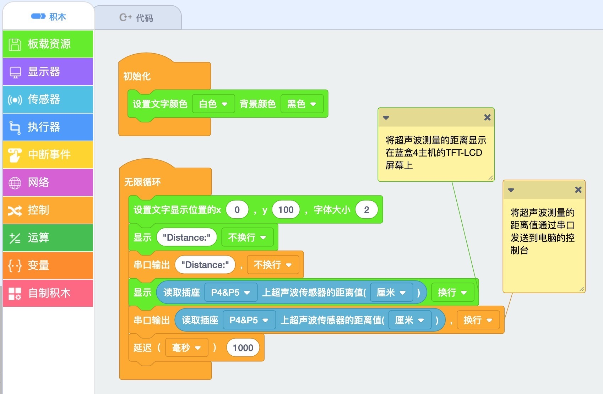
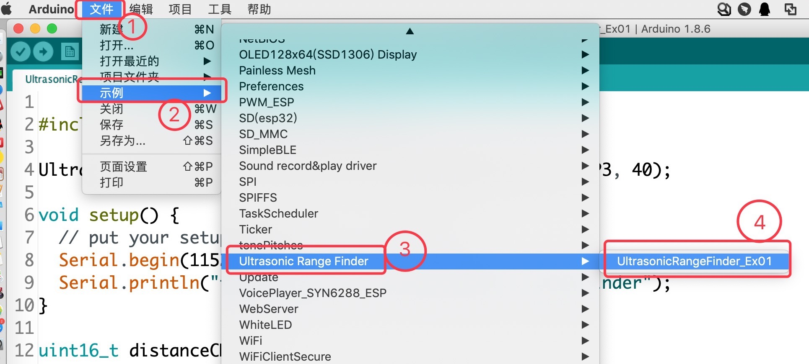

.. _Grove_S16_UltrasonicDistanceMeasuringModule:

====================
Grove接口超声波测距模块(2～400cm)
====================

我们声带发出的声波信号，也就是说话所发出的声音，实际上是一种空气振动波信号。描述波信号的物理量主要有振幅和频率。
人体声带发出的声波信号频率不超过20KHz，所以人们习惯把超过20KHz的声波称作“超声波”，并把20Hz以下的声波信号被称作“次声波”。
超声波具有非常好的方向性和反射能力，即它能沿着直线传播，遇到障碍物时会反射。人们利用超声波的这两个特性(方向性和反射性)
开发出各种各样的超声波应用，用于测距、测速、清洗、焊接、碎石、杀菌消毒等。

超声波测距传感器不仅利用超声波的方向性、反射性，还利用超声波在空气中的传播速度是一个常数。超声波传感器的外型如下图。

超声波测距传感器由超声波发射器、超声波接收器和声波信号处理单元组成。

使用超声波传感器时，发射器首先发射出一束超声波，当这束超声波遇到障碍物时将会被反射会传感器，这束反射波被接收器所接收。
从超声波发射出去开始计时，当收到反射波时停止计时，计时器所记录的时间间隔正好是超声波在空气中的传播时间。将测量计时器
给出的超声波传播时间乘以超声波在空气中的传播速度(即340m/s)，我们将得到这束超声波的传播路程，这个路程的一半正好就是
超声波传感器与障碍物之间的距离。我们用下图解释超声波是如何测量“传感器与障碍物之间距离”。

.. note:: 
请注意超声波传感器的局限性：
  * 近距离盲区。当障碍物和传感器之间距离太小，反射波不能进入接收器。盲区的大小受发射器和接收器的安装距离限制。
  * 最大测量距离。超声波是一种能量束，随着传播距离增加能量不断消耗，无法反射到接收器。最大测量距离由发射波的能量大小决定。

-----------------------------------

超声波传感器的技术参数
==================

==========  ==========
参数          有效范围
量程          2～400cm
精度          1cm
有效角度      15度
电气接口      4线(2mm间距)Grove
输出格式      PWM(高电平宽度=超声波传播时间)
触发信号      Trig(不小于10us的高电平)
供电电压      3.0~5.0V
供电电流      15mA(5V供电时最大电流)
接口逻辑      3.3V/5.0V
工作温度      -25~+85度
环境湿度      30~60%
外型尺寸      40x18x25mm(LxWxH)
固定孔距      14.4x36.4mm(M2螺丝)
重量          36g
==========  ==========

.. caution:: 
  * 超声波传感器不允许热插拔操作！接线时必须先断电，确保线路连接正确后再通电使用
  * 超声波传感器模块兼容3.3V和5.0V逻辑，供电电压分别为3.3V和5.0V，更高或更低电压都会造成传感器损坏或工作不正常

超声波传感器模块的用法
==================

超声波传感器模块的电气接口采用4线(2mm间距)的Grove接口，4个引脚的名称和功能如下：

========  ========  ========
1         Gnd       电源地线
2         Vdd       电源正极
3         TrigIn    启动测量的触发信号输入
4         PwmOut    脉冲宽度信号输出
========  ========  ========

如何使用超声波传感器模块测量传感器与障碍物之间的相对距离呢？
当我们需要启动超声波传感器测量时，首先使用计算机的可编程I/O输出一个测量触发信号给TrigIn引脚。注意，TrigIn的有效信号
为宽度不小于10us(微妙)的高电平信号！超声波传感器模块的信号处理电路单元会立即响应这一请求测量信号，开启超声波发射器并
发射一束超声波，同时让PwmOut引脚输出高电平，并保持该电平，直到接收器收到反射波后立即将PwmOut引脚变为第电平。
这束超声波信号遇到障碍物后被反射，如果反射角在正确范围内，反射波将会进入接收器。

.. note:: 
  * 超声波传感器和障碍物反射面的姿态决定反射波能否进入接收器
  * 如果超声波传感器接收不到发射波，我们的程序应该如何容错以避免测量流程只能傻傻地等呢？
    (提示：根据量程的最大值400cm，超声波在空气中的传播速度340m/s。你能计算出测量过程需要等待的最长时间为多少ms?)

在Scratch环境使用超声波传感器
=========================

`应用示例1`_ : 

我们浏览器中打开 `易造云平台`_ (https://www.ezaoyun.com/)，在主页面的工具栏中选择 `Scratch`_ 将会打开在线版
Scratch编程环境。这个在线版Scratch编程环境不仅完全兼容MIT版的Scratch3，还支持硬件编程。换句话说，你可以使用自己熟
悉的Scratch图形化编程语言进行编程来控制计算机硬件，与计算机硬件交互。譬如，我们可以用Scratch编程控制超声波传感器模块
测量传感器与障碍物之间的距离，进而实现走迷宫的小车，随机行走的小车自动避开障碍物等。

首先，我们看看Scratch编程环境中的超声波传感器的位置。在Scratch编程环境的角色选择区，点击“硬件”标签，然后点击“添加硬件”标签，
在打开的硬件选择窗口中选择 `BlueBox4/蓝盒4`_ 。这一步操作类似于“添加角色”。接着，打开“传感器“积木抽屉，滚动鼠标滑轮，
你将会看到”距离传感器“类，将超声波传感器积木块拖放至程序编辑区。

然后，我们来看一个简单的超声波应用示例，目标是把超声波传感器模块测量结果显示到 `BlueBox4(蓝盒4)`_ 的TFT-LCD屏幕上，
同时通过USB串口将测量结果传送到电脑端。实现这一任务目标的Scratch积木块程序如下图。

当你把本例程序编写完毕后，最后就是测试程序的执行效果。动手试一试吧！

.. _应用示例1: https://www.ezaoyun.com/project/cppBlockly_detail/2784
.. _易造云平台: https://www.ezaoyun.com/
.. _Scratch: https://www.ezaoyun.com:6363/
.. _BlueBox4(蓝盒4): http://www.hibottoy.com/blueBox.html

在Arduino环境使用超声波传感器
=========================

如果你已经安装 `Arduino IDE 1.8x`_ 只需要安装 `BlueBox4(蓝盒4)`_ 的BSP(板级支持包)即可实现下面的示例。

复制下面的 `BlueBox4(蓝盒4)`_ 的BSP链接：
https://www.ezaoyun.com:8888/hardware/bluebox4/package_bluebox4_index.json

并根据下图提示的过程维护BSP URL 

.. image:: ../_static/images/GroveModules/Grove_S16_UltrasonicDistanceMeasuringModule/Install_BB4_BSP_1.jpeg
    :align: center

然后启动Arduino的“开发板管理器”，步骤如下图所示。

.. image:: ../_static/images/GroveModules/Grove_S16_UltrasonicDistanceMeasuringModule/Install_BB4_BSP_2.jpeg
    :align: center

在弹出的"Arduino开发板管理器"窗口的搜索栏输入“BlueBox”，然后选择安装BlueBox4。

.. image:: ../_static/images/GroveModules/Grove_S16_UltrasonicDistanceMeasuringModule/Install_BB4_BSP_3.jpeg
    :align: center

或许你在想，使用超声波传感器模块，为啥要安装 `BlueBox4(蓝盒4)`_ 的BSP?
这个BSP包含有超声波传感器的C++库！当你安装好 `BlueBox4(蓝盒4)`_ 的BSP之后，就可以直接使用超声波传感器了。

应用示例2:

这个示例也就是超声波传感器模块的Arduino库自带的，按下图所述过程打开该示例。

为了将本示例程序下载到 `BlueBox4(蓝盒4)`_ 主控制器，我们需要点击Arduino IDE的“编译并下载”按钮。注意，在此之前请确保超声波
传感器模块已经正确地连接到 `BlueBox4(蓝盒4)`_ 主控制器的P2-P3端口，而且已经使用USB数据线将 `BlueBox4(蓝盒4)`_ 主控制器与
电脑的USB端口连接好。

下载完毕后，请打开Arduino IDE的串口监视器，你将会看到如下图的信息

.. image:: ../_static/images/GroveModules/Grove_S16_UltrasonicDistanceMeasuringModule/UltrasonicDistanceModule_1.jpg
    :align: center

试一试改变传感器与障碍物之间的距离，观察Arduino IDE的串口监视器给出的信息。

至此，如果你亲自动手试过上述的示例，相信你已经完全掌握超声波传感器模块的用法。

如果你使用的Arduino板而不是 `BlueBox4(蓝盒4)`_ ，这就需要你根据示例2进一步了解超声波传感器模块的软件接口。示例2的源代码如下

.. code-block:: 
   :linenos:

    #include <UltrasonicRangefinder_ESP.h>  
    UltrasonicRangefinder sensor = UltrasonicRangefinder(P4, P5, 40);

    void setup() {
    Serial.begin(115200); // initialize Serial
    Serial.println("the Example of the Ultrasonic range finder");
    }

    void loop() {
    uint16_t valueSensorCM = sensor.MeasureInCentimeters(); // uint: cms
    //float valueSensorInches = sensor.MeasureInInches(); // uint: inches
    Serial.print("the Distance: ");
    Serial.println(valueSensorCM);
    //Serial.println(valueSensorInches);
    delay(1000);
    }

* 第1行代码的目的是包含超声波传感器模块的库
* 第2行代码声明一个超声波传感器实体对象，名称叫sensor，类型UltrasonicRangefinder即超声波传感器的类型，超声波传感器类型三个参数分别为：PwmOut和TrigIn引脚编号，触发电平的宽度(时间单位采用微妙)。这里我们把触发电平设置为40微妙
* 第10、11行代码分别是以厘米(cm)和英寸(inch)为长度单位启动超声波传感器测量并返回相应单位的测量结果

.. _Arduino IDE 1.8x: www.arduino.cc 
